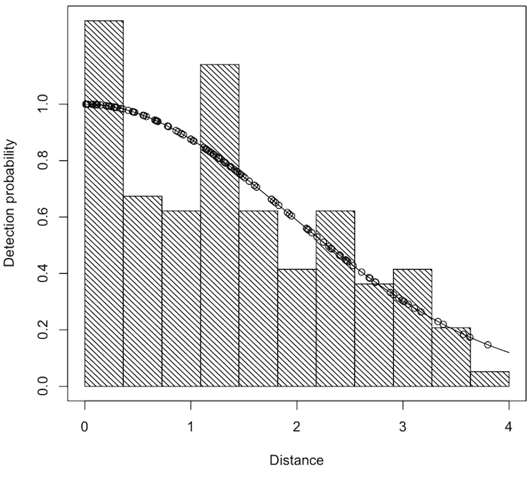
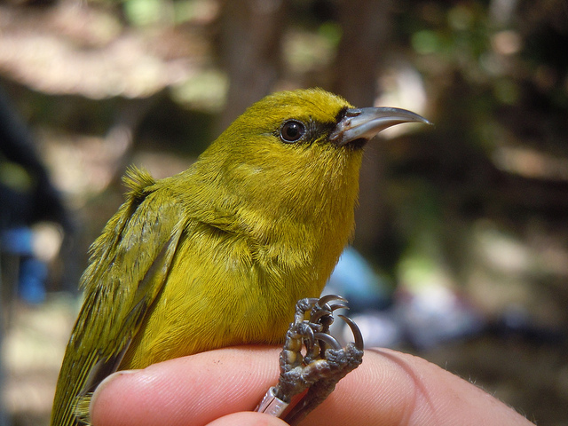

<p align="center"><big>Distance sampling<br/>and<br/> detection function modelling<br>in `Distance`</big><br/><br/>
David L Miller<br/>CREEM, University of St Andrews<br/><br/>
British Trust for Ornithology<small><br/>
Thetford, UK<br/>
26 June 2015</small>
<br/>
<br/>
<br/>
</p>


## Who is this guy?

  * Statistician by training (St Andrews)
  * PhD University of Bath, w. Simon Wood
  * Postdoc, University of Rhode Island
  * Research fellow at CREEM
  * Developer of distance sampling software


```{r knitr-setup, include=FALSE}
knitr::opts_chunk$set(fig.align="center", cache=TRUE)
```

##

<div class="quote">Ecological questions</div>

##

<div class="bigquote">How many animals are there?</div>

##

<div class="bigquote">Where are all the animals?</div>

##

<div class="bigquote">Why are they there?</div>


##

<div class="quote">Distance sampling</div>


## Line transect distance sampling


## Point transect distance sampling

```{r fig.cap="", echo=FALSE,cache=TRUE, fig.height=9, fig.width=9, message=FALSE}
set.seed(131) # same results every time
library(mgcv) # for inSide

N <- 500
# generate population locations
x <- runif(N)
y <- runif(N)

plot(x,y, pch=19,asp=1,cex=0.8,main="",col="grey")

# set sigma
sigma <- 0.05
# storage for detected distances
detected_distances <- c()
# lay out a grid of points
pt <- as.list(expand.grid(x=seq(0.15,0.85,len=3),y=seq(0.15,0.85,len=3)))
for(i in 1:length(pt$x)){
  # generate point location
  # plot the line transect
  points(pt$x[i], pt$y[i], pch=19, col="blue",cex=1.4)
  # calculate the distances to animals from the line
  distances <- sqrt((pt$x[i] - x)^2+(pt$y[i]-y)^2)
  # randomly decide which were detected
  detected <- exp(-distances^2/(2*sigma^2)) > runif(length(distances))
  # plot those animals detected
  points(x[detected],y[detected],pch=19,cex=0.8,col="red")
  # collect the distances to detected objects
  detected_distances <- c(detected_distances,distances[detected])
}
```


## Detection functions

  * Compute a "correction factor" to estimate abundance
  * Model $\mathbb{P} \left[ \text{animal detected } \vert \text{ object at distance } y\right] = g(y;\boldsymbol{\theta})$
  * Calculate the average probability of detection:

$$
P_a = \int_0^w g(y;\boldsymbol{\theta}) \pi_y(y) \text{d}y
$$

(where $\pi_y(y)$ tells you about geometry of the sampler)

  * Horvitz-Thompson-type estimators $\Rightarrow \hat{N}$


## Detection functions



## Criteria for detection functions

  1. flexible (*wide variety of shapes*)
  2. efficient (*few parameters)*
  3. flat at 0 distance (*detect what's in front of you)*
  4. monotonic non-increasing with increasing $y$ (*not easier to see far away things)*


##  Some example detection functions


## Modelling

  * Detection function is fixed -- many shapes
  * Estimate parameters by maximum likelihood
  * Select number of adjustments by forward-AIC
  * Model checking by goodness-of-fit testing
  * Can include covariates other than distance


##

<div class="quote">Case study: Amakihi</div>


## Getting software


To get the latest versions:

```{r eval=FALSE}
install.packages("devtools")
devtools::install_github("DistanceDevelopment/Distance")
devtools::install_github("DistanceDevelopment/mrds")
```

## Amakihi (*Hemignathus virens*) survey

  * Data from Marques et al (2007), data from Steve Fancy (NPS)
  * 1485 observations (1243 post-truncation)
  * 41 point transects, 1992-1995

<div align="center"></div>

<small>Photo: <a href="https://www.flickr.com/photos/50838842@N06/7123149677">USFWS Flickr</a></small>

## Amakihi (*Hemignathus virens*) data

  * 3 covariates:
     - observer (a three level factor)
     - minutes after sunrise (continuous)
     - hours after sunrise (a six level factor).
  * Data on figshare [`http://figshare.com/articles/Amakihi_point_transect_data/1293039`](http://figshare.com/articles/Amakihi_point_transect_data/1293039)

```{r cache=TRUE}
# read the data from figshare
amakihi <- read.csv("http://files.figshare.com/1870557/amakihi.csv")
head(amakihi)
```

## Inspecting the distane data

```{r fig.cap="", fig.width=9, cache=TRUE}
hist(amakihi$distance, main="Histogram of distances", xlab="Distance (m)")
```


## Inspecting the covariates

```{r fig.cap="", fig.width=12, cache=TRUE}
par(mfrow=c(1,3))
hist(amakihi$has, main="Histogram of hours after sunrise", xlab="Hours after sunrise")
hist(amakihi$mas, main="Histogram of minutes after sunrise", xlab="Minutes after sunrise")
barplot(table(amakihi$obs), col="white", main="Histogram of observer", xlab="Observer")
```


## Fitting some models

```{r}
library(Distance)
am.hn <- ds(amakihi, truncation=82.5, transect="point")
```

## Plotting a detection function


```{r fig.cap=""}
plot(am.hn, breaks=seq(0,82.5,len=20))
```


##

<div class="bigquote">Yuck!</div>


## Model summaries

```{r cache=TRUE}
summary(am.hn)
```


## Model checking: truncation

  * Here truncate at 82.5m.
  * Generally, a trade-off
    - don't want to "waste" data
    - truncation can increase $p$ (less area)
    - but will reduce precision (fewer observations)
  * No hard-and-fast rules
  * LJT: $g(w) \approx 0.15$ "okay"


## Model checking: Q-Q plot

```{r fig.cap="", results="hide"}
ds.gof(am.hn)
```

## Model checking: goodness-of-fit tests

  * Kolmogorov-Smirnov
    - “what’s the largest vertical distance between a point and the y = x line?”
  * Cramer-von Mises
    - “what’s the sum of all the distances between a point and the y = x line?”

```
Distance sampling Kolmogorov-Smirnov test
Test statistic =  0.026715  P =  0.33756

Distance sampling Cramer-von Mises test (unweighted)
Test statistic =  0.10577  P =  0.55731
```

## Model checking: goodness-of-fit tests

<div align="center"></div>


## Model checking: monotonicity

  * "always more difficult to see things further away"
  * maths: $g(x_i) > g(x_{i+1})$
  * check with `check.mono`

```{r fig.cap="", results="hide", warning=FALSE}
check.mono(am.hn$ddf, plot=TRUE)
```

## Model checking: monotonicity (when bad things happen)

```{r echo=FALSE}
set.seed(933)
```

```{r fig.cap="", results="hide", warning=FALSE, message=FALSE}
am.hn.bad <- ds(amakihi, truncation=82.5, transect="point",
                monotonicity="none", order=c(2,3))
mrds::check.mono(am.hn.bad$ddf, plot=TRUE)
```

## More models - hazard-rate

```{r}
am.hr <- ds(amakihi, truncation=82.5, transect="point", key="hr")
```

## More models - hazard-rate with covariates

```{r}
am.hr.oh <- ds(amakihi, truncation=82.5, transect="point",
               key="hr", formula=~obs+has)
am.hr.o <- ds(amakihi, truncation=82.5, transect="point",
              key="hr", formula=~obs)
```


## Hazard-rate with covariates `summary`

```{r}
summary(am.hr.oh)
```


## Plotting a detection function


```{r fig.cap="", fig.width=12}
par(mfrow=c(1,2))
plot(am.hr, breaks=seq(0,82.5,len=20))
plot(am.hr.oh, breaks=seq(0,82.5,len=20))
```

## Estimating abundance

  * Simple `flatfile` format
  * Duck nest data

```{r}
ducknests <- read.csv("http://distancesampling.org/R/vignettes/ducknests.csv")
head(ducknests)
```

## Duck nest abundance

Horvitz-Thompson-like estimator

```{r}
halfnorm.ducks <- ds(ducknests, key="hn", adjustment="cos",
                     convert.units = 0.001)
```

## Duck nest results

```{r}
halfnorm.ducks$dht
```

## Horvitz-Thompson

<div class="quote">
$$
\hat{N} = \sum_{i=1}^n \frac{s_i}{\hat{p}_i}
$$
</div>


## Summary

  * `Distance` makes building models easy
  * Model checking
  * Many models possible (all in AIC framework)
  * Estimate abundance
  * Examples at [distancesampling.org/R](http://distancesampling.org/R)


## In the works

  * New software `Distance2`
  * A "book" [converged.yt/RDistanceBook](http://converged.yt/RDistanceBook)
  * `readdst` to convert Distance for Windows projects

## Thanks!


<div class="quote">Talk available at:

[converged.yt/talks/BTO-distance/talk.html](http://converged.yt/talks/BTO-distance/talk.html)
</div>


## References

Buckland, S. T., Anderson, D. R., Burnham, K. P., Laake, J. L., Borchers, D. L., & Thomas, L. (2001). Introduction to Distance Sampling. Oxford University Press.

Buckland, S. T., Anderson, D. R., Burnham, K. P., Laake, J. L., Borchers, D. L., & Thomas, L. (2004). Advanced Distance Sampling. Oxford University Press.

Marques, T. A., Thomas, L., Fancy, S. G., & Buckland, S. T. (2007). Improving estimates of bird density using multiple-covariate distance sampling. The Auk, 124(4).

Thomas, L., Buckland, S. T., Rexstad, E. A., Laake, J. L., Strindberg, S., Hedley, S. L., et al. (2010). Distance software: design and analysis of distance sampling surveys for estimating population size. Journal of Applied Ecology, 47(1), 5–14.


