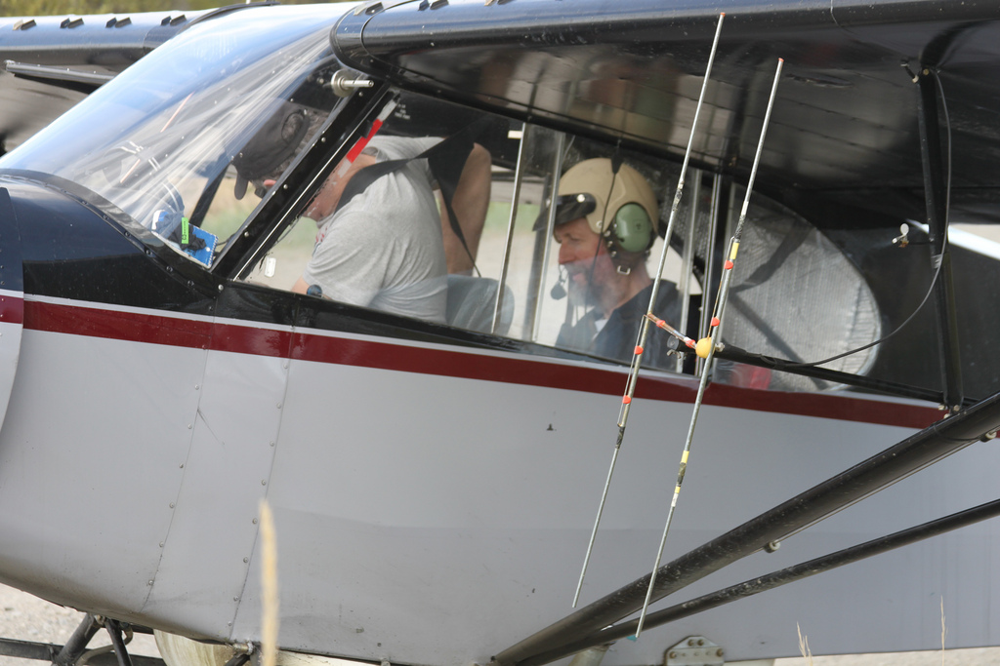
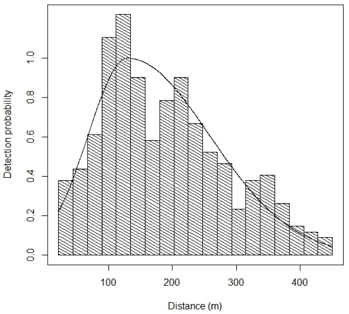
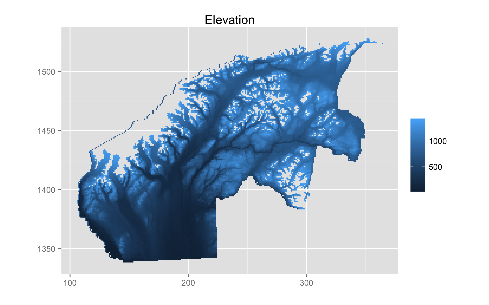

% If you go down to the woods today: spatially explicit models of black bears in Alaska
% David L Miller (CREEM)
% CREEM Seminar, 18 December 2013

## Susitna-Watana dam

  * 5th largest dam in the world
  * On the Susitna river in South-Central Alaska
  * AK Fish & Game contracted to provide black and brown bear numbers
  * Earl Becker & DLM to investigate data from 2001-2003

## Problems

  * Need reliable and *spatially explicit* estimates
  * Use existing data (no $ for new surveys)
  * Biological interpretability
  * HUGE area
  * Understandable to managers

##

## Survey area

  * Game Management Unit 13E (plus a bit extra)
  * Area of 26,482 km2
  * ~1/3 size of Scotland
  * ~ size of Vermont/Massachusetts

## {.cover}

## Aerial line transects

  * Double observer surveys using Piper Super Cubs
  * 1238, 35km transects, 2001-2003

## 1238 transects

## {.cover}

## {.cover}

## {.cover}

## {.cover}

## Survey protocol

  * Surveys in Spring, bears are there, but not too much foliage
  * Generally search uphill
  * Curtain between pilot and observer; light system
  * Go off transect and circle to ID

## Spatial modelling using DSM

  * Segment transects (GIS, 43,838)
  * Allocate counts to segments
  * Correct for detectibility (and $g(0)\neq1$)
  * Fit a GAM

## Spatial modelling using DSM

  * Segment transects (GIS, 43,838)
  * Allocate counts to segments
  * Correct for detectibility (and $g(0)\neq1$)
  * Fit a GAM

## Spatial modelling using DSM

  * Segment transects (GIS, 43,838)
  * Allocate counts to segments
  * Correct for detectibility (and $g(0)\neq1$)
  * Fit a GAM

## Spatial modelling using DSM

  * Segment transects (GIS, 43,838)
  * Allocate counts to segments
  * Correct for detectibility (and $g(0)\neq1$)
  * Fit a GAM

## Distance sampling

  * Double observer model *a la* Borchers et al (2006)
  * Independent observers, with point independence
  * Partial likelihood:
      <!--- Mark-recapture: $\mathcal{L}_\omega(\mathbf{\theta}) = \prod_{i=1}^{n\bullet} \frac{\mathbb{P}\left[ \mathbf{\omega}_i \vert y_i, \mathbf{z}_i\right]}{p_\bullet(y_i,\mathbf{z}_i)}$
      - Detection function: $\mathcal{L}_{y\vert\mathbf{z}}(\mathbf{\theta}) = \prod_{i=1}^{n\bullet} \frac{p_\bullet(y_i,\mathbf{z}_i) \pi(y_i)}{p_\bullet(y_i,\mathbf{z}_i)}$-->
      - Mark-recapture: estimate $\mathbb{P}[\text{detection at apex}]$
      - Detection function: estimate detection probabilities
  * Use ML for both.
  * Estimate per-segment abundance using Horvitz-Thompson
  $$
  \hat{N}_j = \sum_{i \in \text{ transect } j}\frac{s_i}{p_i}
  $$

## {.cover}

## Detection function

  * 2-part normal detection function (Becker & Christ, in prep)
  * Avoid heavy left truncation (discard ~30% data)
  * Modelling by EB

## Black bears

  * Saw 373 groups 8.4-711.8m
  * Truncate at 22m and 450m, leaving 351 groups
  * Group size 1-3 (lone bears, sow w. cubs)
  * 1402m elevational cutoff

## Detection function 

  * covariates:
    - distance
    - indicator for distance greater than the mode (required to make the distribution gamma-like)
    - log of search distance
    - pilot search type
  * Mode at about 129 metres

Search distance: distance from line to the furthest location.

Pilot search type: 2 groups, with one group searching further out.

## Spatial modelling

  * Using a density surface model (of course!)
  * Just a GAM
  * Model adjusted counts per segment
  
  $$
  \mathbb{E}(\hat{N}_j) = A_j \exp \left( \sum_k f_k(\zeta_{jk}) \right)
  $$

  where $f_k$ are smooths of covariates $\zeta_k$, segment area $A_j$

  and

  $$
  \hat{N}_j = \sum_{i \in \text{ transect } j}\frac{s_i}{p_i}
  $$

## {.cover}

## {.cover}

## {.cover}

## {.cover}

## {.cover}

## {.cover}

## Other modelling details

  * Giant zero-inflation (~350 out of ~44,000 segments)
  * Tried both Tweedie and Negative Binomial response
  * Negative binomial best fit
  * "Primative parallelisation" to find parameter

## Randomised quantile residuals

  * Goodness of fit testing
  * Dunn and Smyth (1996)
  * Back transform for **exactly** Normal residuals
  * Less problems with artefacts
  * (Thanks to Natalie Kelly at CSIRO for the tip)

## `gam.check`

## `rqgam.check`

## Selecting smooth terms

  * REML smoothness estimation
  * AIC model selection (usual REML constraints)
  * (approximate) $p$-values
  * extra penalty
  * biological plausability

## Final model

  * bivariate smooth of location
  * smooth of elevation
  * bivariate smooth of slope and aspect

## 

## 

# Abundance estimate for GMU13E

  * MRDS estimate: ~1500 black bears
  * DSM estiamte: ~1200 black bears
  * Not a *huge* difference, so why bother?

## Abundance map

## CV map

## Conclusion

  * Two-stage models can be useful!
    - split modelling
    - split work
  * Spatial component is v. helpful for managers

## Future work

  * Paper write-up
  * Already a lot of spatially explicit data available

## {.cover}

## References

  * Becker, EF, and PX Quang. A Gamma-Shaped Detection Function for Line-Transect Surveys with Mark-Recapture and Covariate Data. Journal of Agricultural, Biological, and Environmental Statistics 14, no. 2 (2009): 207–223.
  * Borchers, DL, JL Laake, C Southwell, and CGM Paxton. Accommodating Unmodeled Heterogeneity in Double‐Observer Distance Sampling Surveys. Biometrics 62, no. 2 (2006): 372–378.
  * Dunn, PK, and GK Smyth. Randomized Quantile Residuals. Journal of Computational and Graphical Statistics 5, no. 3 (1996): 236–244.
  * Miller, DL, ML Burt, EA Rexstad and L Thomas. Spatial Models for Distance Sampling Data: Recent Developments and Future Directions. Methods in Ecology and Evolution 4, no. 11 (2013): 1001–1010.

Talk available at [http://dill.github.com/talks/akbears/talk.html](http://dill.github.com/talks/akbears/talk.html)

## Thanks

  * Earl Becker
  * Becky Strauch
  * Mike Litzen
  * Dave Filkill

