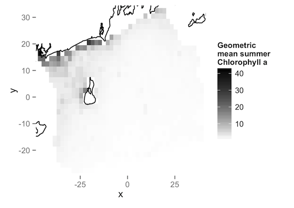
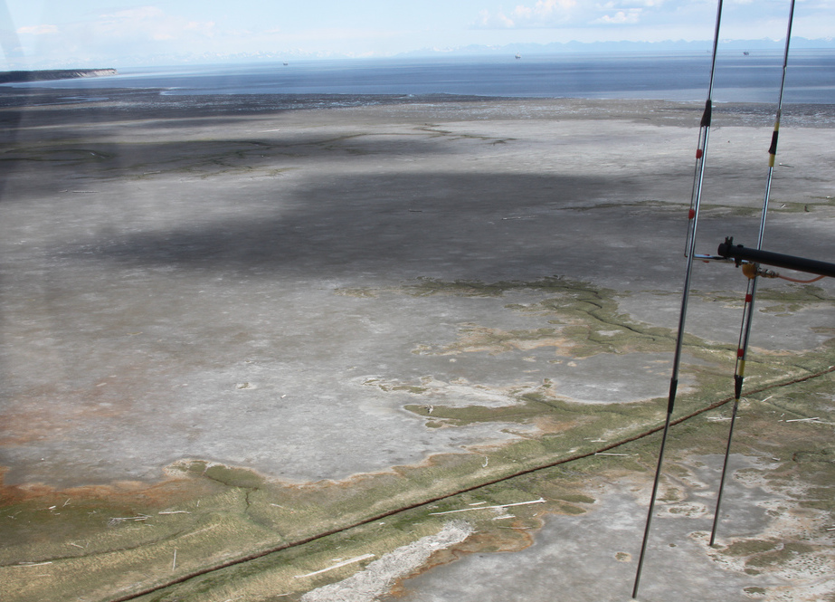
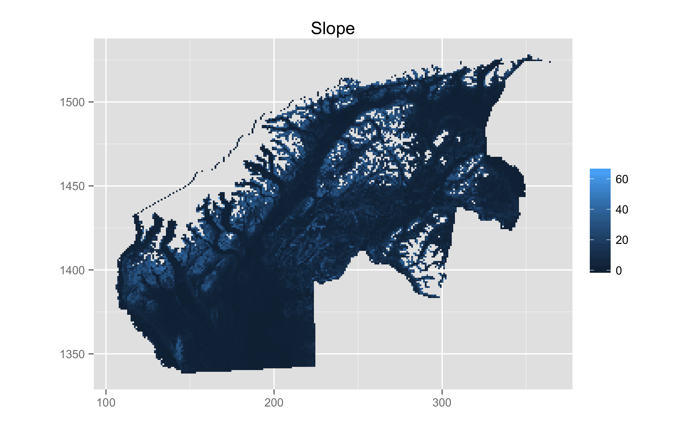
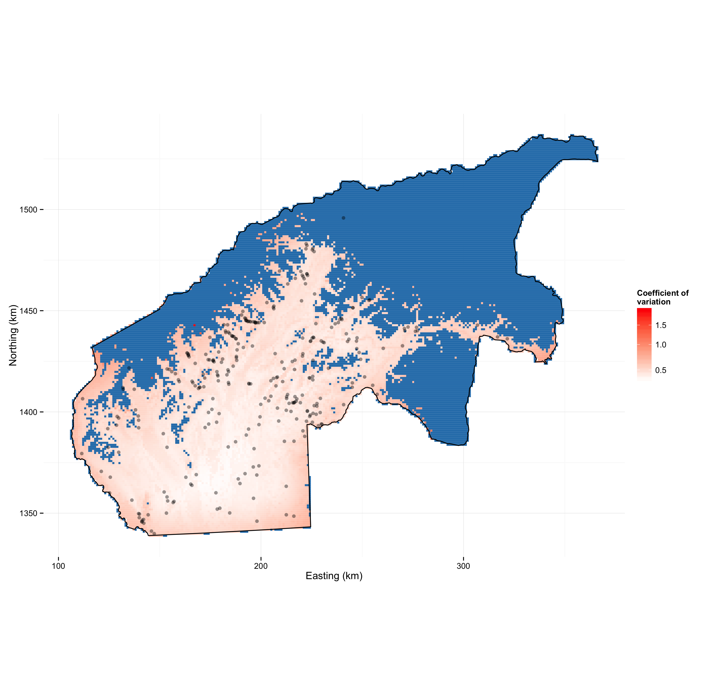
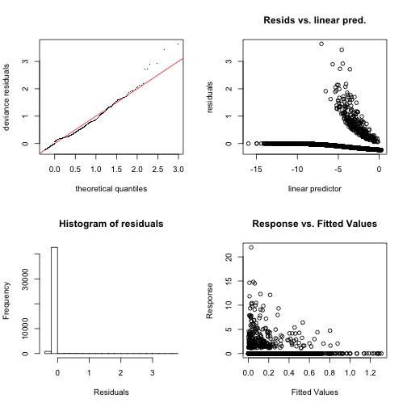

##

<big>Density surface models</big>  
David L Miller (<i>CREEM, University of St Andrews</i>)   
<small>Cornell University 
5 September 2014</small>
 
 
 
 
 
 

##

Spatial modelling

## Ecological questions

  * How many animals are there?
  * How do environmental factors effect animals?
  * Where are the animals?
  * How certain are we about the above?

## Ecology $\Rightarrow$ statistics

  * Want to model counts
    - uncertain detection
    - availability issues
  * Counts are functions of covariates
    - Want to select the covariates
    - Covariate effects must be flexible
  * Spatially explicit models
  * Uncertainty quantification

##

Density surface models

## Density surface models

  * Take count data
  * Adjust/account for detectability/availability
  * Fit a GAM w. environmental explanatory variables
  * Perform inference on GAM

## Compatible survey data sources

  * Strip transects
  * Line transects
  * Point transects
  * (more, depending on how strict you are with terminology)

## Line transects

## Data setup 

<small><i>Ursus</i> from <a href="http://phylopic.org/name/9c912370-8905-41f7-b3a3-9fdd99aff88c">PhyloPic</a>.</small>

##

Detectability

## Distance sampling

## Detection functions

  * Essentially want to compute "correction factor"
  * Model $\mathbb{P} \left[ \text{animal detected } \vert \text{ object at distance } y\right] = g(y;\boldsymbol{\theta})$
  * Calculate the average probability of detection:

$$
P_a = \frac{1}{w} \int_0^w g(y;\boldsymbol{\theta}) \text{d}y
$$

  * Horvitz-Thompson-type estimators $\Rightarrow \hat{N}$

## Detection functions

## Distance sampling

  * Extend $\mathbb{P} \left[ \text{animal detected } \vert \text{ object at distance } y, \text{ observed covariates}\right] = g(y, \mathbf{z};\boldsymbol{\theta})$
  * Double observer (account for $g(0)<1$)
  * Detection function formulations
  * Measurement error

&nbsp;

<small>Figure from Marques et al (2007), The Auk</small>

##

Spatially explicit models

## Two pages generalized additive models (I)

If we are modelling counts:

$$
\mathbb{E}(n_j) = A_j\exp \left\{ \beta_0 + \sum_k f_k(z_{jk}) \right\}
$$

  * $n_j$ has some count distribution (quasi-Poisson, Tweedie, negative binomial)
  * $A_j$ is area of segment
  * $f_k$ are *smooth* functions (splines $\Rightarrow f_k(x)=\sum_l \beta_l b_l(x)$)
  * $f_k$ can just be fixed effects $\Rightarrow$ GLM
  * Add-in random effects, correlation structures $\Rightarrow$ GAMM
  * Wood (2006) is a good intro book

## Two pages generalized additive models (II)

Minimise distance between data and model while minimizing:

$$
\lambda_k \int_\Omega \frac{\partial^2 f_k(z_k)}{\partial z_k^2} \text{ d}z_k
$$

<h2>"just wiggly enough"</h2>

## Two options for response 

<h2>$n_j$ - raw counts per segment</h2>

$$
\mathbb{E}(n_j) = A_j \hat{p}_j \exp \left\{  \beta_0 + \sum_k f_k(z_{jk}) \right\}
$$

&nbsp;

<h2>$\hat{n}_j$ - H-T estimate per segment</h2>

$$
\hat{n}_j = \sum_{i \text{ in segment } j} \frac{s_i}{\hat{p}_i}
$$

$$
\mathbb{E}(\hat{n}_j) = A_j \exp \left\{  \beta_0 + \sum_k f_k(z_{jk}) \right\}
$$

##

Case study I - Seabirds in RI waters

## Case study I - Seabirds in RI waters

## RI seabirds - Aims

  * Wind development in RI/MA waters
  * Map of usage
  * Estimate uncertainty
  * Combine maps (Zonation)

<small>Photo by <a href="http://www.flickr.com/photos/jackanapes/44534740/in/photolist-4WfCm-5fGWY-5kcwt-gYsVe-gYsVf-rfrFy-wk8SY-Bbkf9-CJGoH-JAwGP-WnzZb-2KrNkj-3YEz3W-49jRDt-49jSgD-49jThH-4eYB5g-4f3AbJ-4iejaL-4iejgf-4nFVgg-4rqKb8-4znidm-4BSyxi-4BWPZw-4Dtb18-4DxqB5-4DxqMY-4EBCuB-4EGy24-4EGy8F-4ELPWu-4KM4T1-5byKfc-5dK7xM-5BmTVz-5GpYcr-5GpZw2-5MEqxV-5Pkq76-76qvBB-76qvNH-76uqKf-7qJ5CU-7v8iXi-7vngHz-dTvFyn-dN222q-dN1Nuj-8oFmQZ-8oFmXD/">jackanapes on flickr</a> (<a href="http://creativecommons.org/licenses/by-nc-nd/2.0/deed.en_GB">CC BY-NC-ND</a>)</small>

## RI seabirds - Detection function modelling 

## RI seabirds - Spatial covariates (I)

## RI seabirds - Spatial covariates (II)

## RI seabirds - spatial model

  * Availability
     - correction factor from previous experimental work
     - $p_j \times \mathbb{P}(\text{available for detection})$
     - (Recent work by David Borchers may be useful)
  * Term selection by approximate $p$-values
  * Covariates are collinear (curvilinear)

## RI seabirds - raw data

## RI seabirds - Covariate effects

## RI seabirds - Results

## RI seabirds - Uncertainty

##

Case study II - black bears in Alaska

## Case study II - black bears in AK

  * Area of 26,482 km2 (~ size of VT/MA)
  * Double observer surveys using Piper Super Cubs
  * 1238, 35km transects, 2001-2003

##

## 1238 transects

## Survey protocol

  * Surveys in Spring, bears are there, but not too much foliage
  * Generally search uphill
  * Double observer (Borchers et al, 2006)
  * Curtain between pilot and observer; light system
  * Go off transect and circle to ID

## Black bears

  * Truncate at 22m and 450m, leaving 351 groups (out of ~44,000 segments)
  * Group size 1-3 (lone bears, sow w. cubs)
  * 1402m elevational cutoff

## {.cover}

## {.cover}

## {.cover}

## {.cover}

## {.cover}

## {.cover}

## "Bears don't like to go too high"

## "Bears like to sunbathe"

## Abundance estimate for GMU13E

  * MRDS estimate: ~1500 black bears
  * DSM estimate: ~1200 black bears (968 - 1635, CV ~13%)
  * Not a *huge* difference, so why bother?

## Abundance map

## CV map

## Conclusions

  * Flexible spatial models
     - GLMs + random effects + smooths + other extras
     - autocorrelation can be modelled
  * Large areas, makes sense
  * Spatial component is v. helpful for managers
  * Two-stage models can be useful!
  * Estimating temporal trends

## Acknowledgements

  * Rhode Island
    * Kris Winiarski, Peter Paton, Scott McWilliams
    * Funding from the State of Rhode Island Ocean Special Area Management Plan
  * Alaska
    * Earl Becker, Becky Strauch, Mike Litzen, Dave Filkill
    * Funding from Alaska Department of Fish and Game

 

## Thanks!

Talk available at [http://converged.yt/talks/cornell-dsm/talk.html](http://converged.yt/talks/cornell-dsm/talk.html)

## References

  * Borchers, DL, JL Laake, C Southwell, and CGM Paxton. Accommodating Unmodeled Heterogeneity in Double‐Observer Distance Sampling Surveys. Biometrics 62, no. 2 (2006): 372–378.
  * Miller, DL, ML Burt, EA Rexstad and L Thomas. Spatial Models for Distance Sampling Data: Recent Developments and Future Directions. Methods in Ecology and Evolution 4, no. 11 (2013): 1001–1010.
  * Winiarski, KJ, ML Burt, Eric Rexstad, DL Miller, CL Trocki, PWC Paton, and SR McWilliams. Integrating Aerial and Ship Surveys of Marine Birds Into a Combined Density Surface Model: a Case Study of Wintering Common Loons. The Condor 116, no. 2 (2014): 149–161. 
  * Winiarski, KJ, DL Miller, PWC Paton, and SR McWilliams. A Spatial Conservation Prioritization Approach for Protecting Marine Birds Given Proposed Offshore Wind Energy Development. Biological Conservation 169 (2014): 79–88.

## The `dsm` package

  * Design "inspired by" ("stolen from") `mgcv`
  * Easy to build simple models, possible to build complex ones
  * Syntax example:

        model <- dsm(count ~ s(x,k=10) + s(depth,k=6),
                     detection.function,
                     segment.data,
                     observation.data,
                     family=negbin(theta=0.1))

  * Utility functions: variance estimation, plotting, prediction etc

## Randomised quantile residuals

  * Goodness of fit testing
  * Dunn, PK, and GK Smyth. Randomized Quantile Residuals. Journal of Computational and Graphical Statistics 5, no. 3 (1996): 236–244.
  * Back transform for **exactly** Normal residuals
  * Less problems with artefacts
  * (Thanks to Natalie Kelly at CSIRO for the tip)

## `gam.check`

## `rqgam.check`

## {.cover}

## {.cover}

## Distance sampling software

  * Distance for Windows
     - Easy to use Windows software
     - Len Thomas, Eric Rexstad, Laura Marshall
  * `Distance` R package
     - Simple way to fit detection functions
     - Me! 
  * `mrds` R package
     - More complex analyses - double observer surveys
     - Jeff Laake, me 

