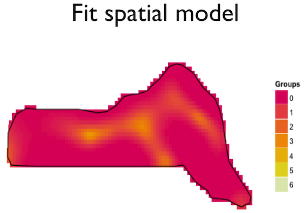

Dealing with spatial autocorrelation in DSMs
============================================

`r opts_chunk$set(fig.align='center',fig.show='hold', out.width=600)`
```{r setup, include=FALSE}
options(width = 50, reindent.spaces = 2)
```


David L. Miller (*University of Rhode Island*)

RUWPA Research Talk

29 July 2013


```{r echo=FALSE, message=FALSE}
library(dsm)
```

```{r cache=TRUE, echo=FALSE, message=FALSE}
# preamble
load("mess.RData")
p.opts.geo <- theme(panel.grid.major=element_blank(),
                    panel.grid.minor=element_blank(),
                    panel.background=element_blank(),
                    strip.background=element_blank(),
                    aspect.ratio=1
                   )
plot.lims <- latlong2km(c(-70.55,-69.8),c(41.2,41.65),
                        mean(ma.state[,1]),mean(ma.state[,2]))
nm <- names(seg.dat)
chl.vals <- apply(seg.dat,1,function(x){
                    as.numeric(x[which(nm==paste0("chl-",
                        gsub("^.*(\\d{4})-(\\d{2})-.*", "\\1-\\2",
                             as.character(x[length(x)]) )))])})
sst.vals <- apply(seg.dat,1,function(x){
                    as.numeric(x[which(nm==paste0("sst-",
                        gsub("^.*(\\d{4})-(\\d{2})-.*", "\\1-\\2",
                             as.character(x[length(x)]) )))])})

seg.dat$chl <- chl.vals
seg.dat$sst <- sst.vals
rm(chl.vals,sst.vals)

seg.dat <- seg.dat[seg.dat$survey_year == 1,]
obs.dat <- obs.dat[obs.dat$survey_year == 1,]
```


# Outline
 * DSM refresher
 * what is spatial autocorrelation (SA)?
 * How does SA manifest itself in DSMs?
 * Detecting SA
 * Methods for dealing with SA
 * Conclusions
 * References

# DSM refresher (I)
 * Collect distance data on (a) species
 * Also collect spatial information - location, covariates
 * Aggregate counts to segments
 * Correct counts/effort using D.S.
 * Fit a GAM(M)

# DSM refresher (II)


# DSM refresher (III)


# DSM refresher (IV)


# DSM refresher (V)




# What is spatial autocorrelation (SA)?
 * Correlation between "signal" and itself
 * Do high (low) values follow high (low) values?
 * Some of this comes from covariates
 * The rest?


# Example data - Nantucket Sound
 * Aerial (strip transect!) surveys of seabirds 2003-2006
 * ~12 surveys per year
 * One year of data (but all 12 surveys)
 * Long tailed ducks only
 * Work in progress!
 * "Analysed" as part of Cape Wind


# Nantucket Sound
```{r cache=TRUE, echo=FALSE, results="hide",message=FALSE, fig.height=20, fig.width=20}
library(ggmap)
p<-ggmap(get_map("Mashpee",9))
print(p)
```

# Transects
```{r cache=TRUE, echo=FALSE, results="hide",message=FALSE,fig.height=20,fig.width=20}
seg.dat1 <- seg.dat[seg.dat$survey == 1,]
seg.dat1$yend <- seg.dat1$y+seg.dat1$Effort
seg.dat1$xend <- seg.dat1$x
# plot segments
p <- ggplot(seg.dat1,aes(x=x,y=y))
p <- p + geom_segment(aes(xend=xend,yend=yend))
p <- p + geom_polygon(aes(x=x,y=y,group=group),data=ma.state)
p <- p + coord_equal(xlim=c(-50,100), ylim=c(-100,40))
p <- p + p.opts.geo
print(p)
```

# How does SA manifest itself in DSMs?
 * Segment definition is arbitrary
 * Adjacent segments are correlated
 * (Maybe proximate transects are correlated?)


# What do per-segment counts look like?
```{r cache=TRUE, echo=FALSE, results="hide",message=FALSE}
sid <- 6
seg.dat1 <- seg.dat[seg.dat$survey == sid,]
obs.dat.ltdu <- obs.dat[obs.dat$species=="LTDU",]
obs.dat1 <- obs.dat.ltdu[obs.dat.ltdu$survey == sid,]
par(mfrow=c(2,2))
for(tid in c(2,3,6,8)){
  seg.dat11 <- seg.dat1[seg.dat1$transect == tid,]
  obs.dat11 <- obs.dat1[obs.dat1$transect == tid,]
  segt <- dsm:::make.data("N",NULL,seg.dat11,obs.dat11,FALSE,1,1,(107*2)/1000)
  barplot(segt$N,main=paste0("Transect ",sid),border=NA,
          names.arg=1:length(segt$N),ylim=c(0,130),cex.lab=0.5)
}
```

# Heirarchical nature
 * Structure is important
 * Sample labels/units must be correct
 * Segment 1 in year 1 and year 2 are **different**
 * Make sure the data makes **sense**!

<table><tr><td></td> <td></td> <td></td></tr></table>

# Detecting SA

Fitting a simple (and not that good!) model:
```{r cache=TRUE,echo=FALSE}
# transect within survey id (used for correlogram)
seg.dat$tr.s.id <- as.numeric(seg.dat$survey)*1000+as.numeric(seg.dat$transect)

s.ids <- c(1:13)[-c(5,6,8,12)]
seg.dat1 <- seg.dat[seg.dat$survey %in% s.ids,]
obs.dat1 <- obs.dat[obs.dat$survey %in% s.ids,]
seg.dat1 <- seg.dat1[order(seg.dat1$tr.s.id,seg.dat1$segment),]
```

```{r cache=TRUE}
ltdu.tw <- dsm(N~s(x,y,k=100),
             ddf.obj=NULL, seg.dat1, obs.dat1,
             strip.width=(107*2)/1000,
             select=TRUE,method="REML",
             family=Tweedie(p=1.5))
```


# Residual autocorrelogram in `dsm`

```{r cache=TRUE, results="hide",message=FALSE}
dsm.cor(ltdu.tw, max.lag=18, Transect.Label="tr.s.id", Segment.Label="segment", ylim=c(-0.1,1), resid.type="scaled.pearson")
```


# Dealing with SA in `dsm`

 * Ignore(!)
 * Location smooths?
 * Along-transect smooths?
 * Correlation structures in `gamm`
 * Need `engine="gamm"`
 * `correlation=...`


# Correlation structures
 * *Mixed effects models in S+* by Pinheiro and Bates
 * Two forms of correlation:
    - "time series"
    - "spatial"
 * Many correlation structures available, not all appropriate
 * We have a psuedo-experimental structure -- use this!

# Correlation structures (II)
 * "spatial" structures are more like kriging
 * Correlation is a 1-D effect *along* the transect
 * Counts are time series along the transects
 * GEE-type approach

# Model formulation

$$
N_i = \color{green}{\mathbf{X_i\beta}} + \color{blue}{\sum_k f_k(\mathbf{x}_i)} + \color{red}{\mathbf{Z_ib}} + \color{purple}{e_i} 
$$

 * <font color="green">fixed effects</font>
 * <font color="blue">smooth terms</font>
 * <font color="purple">error</font> -- **this is the interesting bit!**
    - $e_i = \phi_1 e_{i-1} + \ldots + \phi_p e_{i-p} +\epsilon_{i}$

# AR and ARMA
 * AR(1):
     - Estimate lag 1 autocorrelation ($\phi$), decreases with lag ($k$)
     - $h(k,\phi) = \phi^k, \quad k=0,1,\ldots, \quad \phi \in (-1,+1)$
     - `correlation=corAR1(form=~segment|transect|survey)`
 * ARMA(p,q)
     - As above, but with $p$ parameters
     - $h(k,\phi) = \phi_1h(\vert k-1 \vert,\mathbf{\phi})+ \ldots + \phi_ph(\vert k-p \vert,\mathbf{\phi}), \quad k=0,1,\ldots, \quad \phi \in (-1,+1)$
     - `correlation=corARMA(form=~segment|transect|survey,p=p)`


# Correlation structures in `dsm`

```{r cache=TRUE, results="hide",message=FALSE,tidy=FALSE}
ltdu.tw.cor <- dsm(N~ s(x,y,k=100),
             ddf.obj=NULL, seg.dat1, obs.dat1,
             strip.width=(107*2)/1000,engine="gamm",
             correlation=corAR1(form=~segment|tr.s.id),
             family=Tweedie(p=1.5))
```

# Did that do anything?
 * check with correlogram (`dsm.cor`)
 * look at CI for correlation effect (`intervals`)

# What is the value of $\phi$?

<small>
```{r cache=TRUE}
intervals(ltdu.tw.cor$lme)
```
</small>

# AR(p) models
```{r cache=TRUE, results="hide",message=FALSE,tidy=FALSE}
ltdu.tw.cor2 <- dsm(N~ s(x,y,k=100),
             ddf.obj=NULL, seg.dat1, obs.dat1,
             strip.width=(107*2)/1000,engine="gamm",
             correlation=corARMA(p=2,form=~segment|tr.s.id),
             family=Tweedie(p=1.5))
```

# AR(p) models - `dsm.cor`

```{r cache=TRUE, echo=FALSE, results="hide",message=FALSE}
par(mfrow=c(2,3))
dsm.cor(ltdu.tw,max.lag=18,Transect.Label="tr.s.id",Segment.Label="segment",ylim=c(-0.1,1),resid.type="scaled.pearson")
dsm.cor(ltdu.tw.cor,max.lag=18,Transect.Label="tr.s.id",Segment.Label="segment",ylim=c(-0.1,1),resid.type="normalized",main=paste0("AR(",1,")"))
dsm.cor(ltdu.tw.cor2,max.lag=18,Transect.Label="tr.s.id",Segment.Label="segment",ylim=c(-0.1,1),resid.type="normalized",main=paste0("AR(",2,")"))

for(ar.p in 3:5){

ltdu.tw.cor <- dsm(N~ s(x,y,k=100),
             ddf.obj=NULL, seg.dat1, obs.dat1,
             strip.width=(107*2)/1000,engine="gamm",
             correlation=corARMA(p=ar.p,form=~segment|tr.s.id),
             family=Tweedie(p=1.5))


dsm.cor(ltdu.tw.cor,max.lag=18,Transect.Label="tr.s.id",Segment.Label="segment",ylim=c(-0.1,1),resid.type="normalized",main=paste0("AR(",ar.p,")"))

}
```

# What are the values of the $\phi$s?

<small>
```{r cache=TRUE}
intervals(ltdu.tw.cor$lme)
```
</small>


# Limitations
 * Simple nested structures
 * Slow!
 * Numerical issues
    - exploits smooth-random effect equivalence
    - uses penalised quasi-likelihood (PQL)
    - relatively numerically unstable (in `mgcv` terms)
 * Can't include `select`, `paraPen` and other terms


# Conclusions
 * Correlation can be tricky to deal with
 * Data structure is very important
 * Slow/numerical problems
 * General approach:
    - build GAM (all terms, use `select`, select response distn)
    - refit with GAMM ("best" model)
    - add in correlation (remove non-sig terms, add in others?)
 * in `dsm`: [github.com/dill/dsm](http://github.com/dill/dsm)
 * new wiki pages appearing soon!
 * talk: [dill.github.com/talks/corr-talk/talk.html](http://dill.github.com/talks/corr-talk/talk.html)
 * code: [raw.github.com/dill/dill.github.com/master/talks/corr-talk/talk.Rmd](https://raw.github.com/dill/dill.github.com/master/talks/corr-talk/talk.Rmd)


