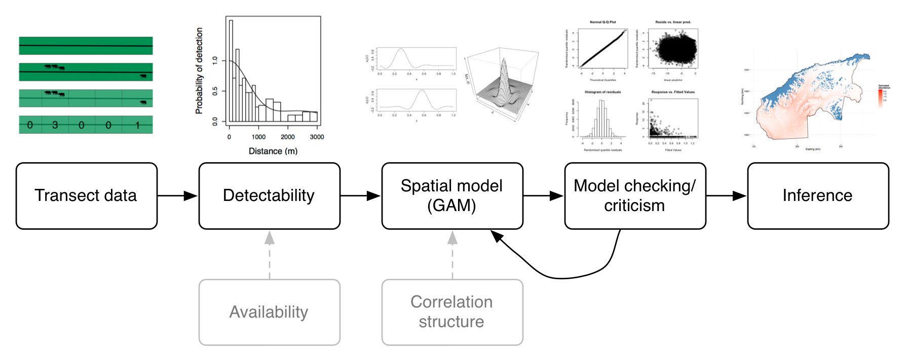
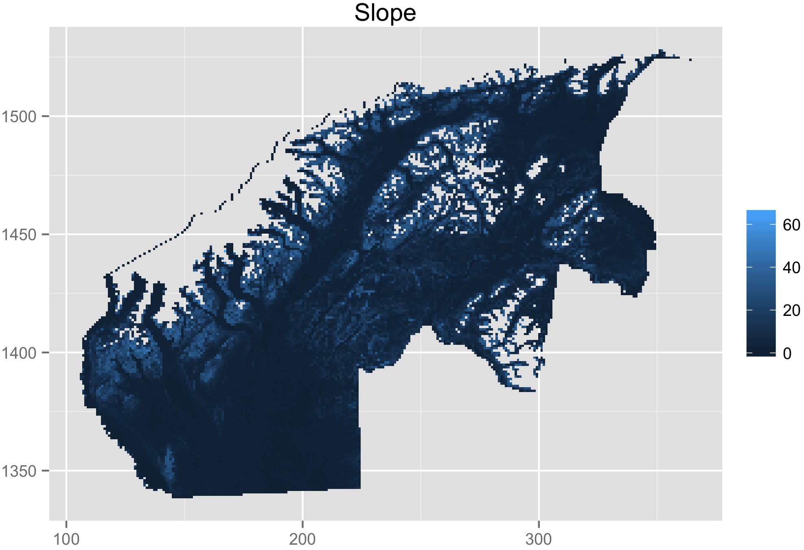
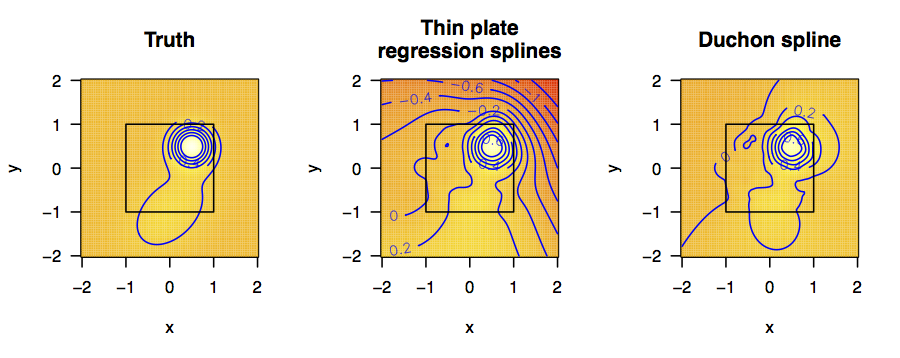

##

<big>Recent advances in spatial modelling of distance sampling surveys</big>  
David L Miller CREEM, University of St Andrews  
Universidade de Lisboa<small> 
Lisbon, Portugal 
11 June 2015</small>
 
 
 
 
 
 

##

Ecological questions

##

How many animals are there?

##

Where are all the animals?

##

Why are they there?

##

Practical question

##

How can we do this?

. . .

 (Statistical methods)

. . .

  (Software)

##

Density surface models

. . .

 (Spatial models that account for detectability)

. . .

  (...and more)

## $\geq 2$-stage models {.cover}

 
 
 

<small>Hedley and Buckland (2004). Miller et al (2014).</small>

##

Detectability

## Distance sampling

<small>Code for animation at <A href="https://gist.github.com/dill/2b0c120d5484d338d8ef">https://gist.github.com/dill/2b0c120d5484d338d8ef</a></small>

## Detection functions

  * Fit to the histogram
  * Model $\mathbb{P} \left[ \text{animal detected } \vert \text{ animal at distance } y\right] = g(y;\boldsymbol{\theta})$
  * Calculate the average probability of detection:

$$
\hat{p}_i = \frac{1}{w} \int_0^w g(y; \mathbf{z}_i, \boldsymbol{\hat{\theta}}) \text{d}y
$$

  * Horvitz-Thompson-type estimators:

$$
\hat{N} = \sum_{i=1}^n \frac{s_i}{\hat{p}_i}
$$

<small>(where $s_i$ are group/cluster sizes)</small>

## Detection functions

## Distance sampling (extensions)

  * Extend $\mathbb{P} \left[ \text{animal detected } \vert \text{ animal at distance } y, \text{ observed covariates}\right] = g(y, \mathbf{z};\boldsymbol{\theta})$
  * Perception bias ($g(0)<1$)
  * Availability bias
  * Detection function formulations
  * Measurement error
&nbsp;

<small>Figure from Marques et al (2007), The Auk</small>

## Mixture model detection functions

 

<small>Data from Daniel Pike, Bjarni Mikkelsen and Gísli Vikingsson. Marine Research Institute, Iceland.</small>

## Mixture model detection functions

  * Miller and Thomas (2015)

##

Spatially explicit models

## Data setup

<small><i>Ursus</i> from <a href="http://phylopic.org/name/9c912370-8905-41f7-b3a3-9fdd99aff88c">PhyloPic</a>.</small>

## Two options for response

<h2>$n_j$</h2>

  - raw counts per segment
  - model offset is *effective area* ($A_j \hat{p}_j$)

&nbsp;

<h2>$\hat{n}_j$</h2>

  - Horvitz-Thompson estimate per segment

$$
\hat{n}_j = \sum_{i \text{ in segment } j} \frac{s_i}{\hat{p}_i}
$$

  - model offset is then area ($A_j$)

## Generalized additive models (in two pages) (I)

If we are modelling counts:

$$
\mathbb{E}(\hat{n}_j) = A_j\exp \left\{ \beta_0 + \sum_k f_k(z_{jk}) \right\}
$$

  * $\hat{n}_j$ has some count distribution (quasi-Poisson, Tweedie, negative binomial, ziP)
  * $A_j$ is area of segment
  * $f_k$ are *smooth* functions (splines $\Rightarrow f_k(x)=\sum_l \beta_l b_l(x)$)
  * $f_k$ can just be fixed effects $\Rightarrow$ GLM
  * Add-in random effects, correlation structures $\Rightarrow$ GAMM
  * Wood (2006) is a good intro book

## Generalized additive models (in two pages) (II)

Minimise distance between data and model *while minimizing*:

$$
\lambda_k \int_\Omega \frac{\partial^2 f_k(z_k)}{\partial z_k^2} \text{ d}z_k
$$

<h2>"just wiggly enough"</h2>

<small>Fitting via REML, see Wood (2011).</small>

## Response distributions

  * "Classically": quasi-Poisson (I've not seen data like this)
  * Lately: Tweedie, negative binomial
  * Exponential family *given* power parameter
  * (`mgcv` can now estimate power parameters via `tw()` and `nb()`)

## Autocorrelation

  * Can use GEE/GAMM structure for autocorrelation along transects
  * $\text{AR}(p)$ process ("obvious" structure)
  * In general this is unstable
    * Random effects are sparse
    * Splines are "dense"
    * $\Rightarrow$ bad for optimisation

##

Case study: Black bears in Alaska

## Case study - black bears in AK

  * Area of 26,482 km2 (~28% size of Portugal)
  * Double observer surveys using Piper Super Cubs
  * 1238, 35km transects, 2001-2003

##

## 1238 transects

## Survey protocol

  * Surveys in Spring, bears are there, but not too much foliage
  * Generally search uphill
  * Double observer (Burt et al, 2014)
  * Curtain between pilot and observer; light system
  * Go off transect and circle to ID

## Black bears

  * Truncate at 22m and 450m, leaving 351 groups (out of ~44,000 segments)
  * Group size 1-3 (lone bears, sow w. cubs)
  * 1402m elevational cutoff

## {.cover}

## {.cover}

## {.cover}

## {.cover}

## {.cover}

## {.cover}

## "Bears don't like to go too high"

## "Bears like to sunbathe"

##

Model selection & checking

## Model selection

  * All possible subsets - expensive; stepwise - path dependence
  * Term selection by shrinkage to zero effect (Marra & Wood, 2011)
  * Approximate $p$-values (Marra and Wood, 2012)

## Residual checking

## Residual checking

## Randomised quantile residuals

  * Count data is nasty for goodness of fit
  * Dunn & Smyth (1996)
  * Back transform for **exactly** Normal residuals
  * Fewer problems with artefacts
  * `dsm::rqgam.check`
  * (Thanks to Natalie Kelly at CSIRO for the tip)

## `rqgam.check`

## Concurvity

$$
\text{Altitude} = f(x,y) + \epsilon \quad \text{or} \quad \text{Chlorophyll A} = f(\text{SST}) + \epsilon
$$

  * Not just correlation!
  * `mgcv::concurvity()` computes measures for fitted models

##

Inference

## Abundance estimate for GMU13E

  * H-T estimate: ~1500 black bears
  * DSM estimate: ~1200 black bears (968 - 1635, CV ~13%)
  * Not a *huge* difference, so why bother?

## Abundance map

## Uncertainty propagation

  * Uncertainty from detection function AND spatial model (and...)
  * Refit model with "extra" term

$$
\log\left[ \mathbb{E}(n_j) \right] = \log\left[A_j p_j(\boldsymbol{\hat{\theta}})\right] + \color{red}{\left[\frac{ \partial \log p(\boldsymbol{\theta})}{\partial\boldsymbol{\theta}} \Big\vert_{\boldsymbol{\theta} = \hat{\boldsymbol{\theta}}}\right] \boldsymbol{\gamma}} + \beta_0 + \sum_k f_k(z_{jk})
$$

  * *random effect* -- fix the corresponding variance matrix $\boldsymbol{\gamma} \sim N(0,-\mathbf{H}^{-1}_\theta)$

<small>Williams et al (2011). Bravington, Hedley and Miller (in prep)</small>

## CV map

##

Conclusions

## Conclusion

  * Detectability
  * Flexible spatial models
     - GLMs + random effects + smooths + other extras
     - autocorrelation can be modelled
     - accounting for uncertainty
  * Large, heterogeneous areas
  * Spatial component is v. helpful for managers
  * Two-stage models can be useful!

## Distance sampling software

  * Distance for Windows
     - Easy to use Windows software
     - Len Thomas, Eric Rexstad, Laura Marshall
  * `Distance` R package
     - Simple way to fit detection functions
     - Me! 
  * `mrds` R package
     - More complex analyses - double observer surveys
     - Jeff Laake, me 

## The `dsm` package

  * Design "inspired by" ("stolen from") `mgcv`
  * Easy to build simple models, possible to build complex ones
  * Syntax example:

        model <- dsm(count ~ s(x,k=10) + s(depth,k=6),
                     detection_function,
                     segment_data,
                     observation_data,
                     family=tw())

  * Utility functions: variance estimation, plotting, prediction etc

## Acknowledgements

  * St Andrews: Eric Rexstad, Len Thomas, Laura Marshall
  * CSIRO: Mark Bravington, Natalie Kelly
  * Alaska: Earl Becker, Becky Strauch, Mike Litzen, Dave Filkill

Funding from Alaska Department of Fish and Game

## Thanks!

Slides available at [http://converged.yt/talks/dsm-talk/talk-Lisbon.html](http://converged.yt/talks/dsm-talk/talk-Lisbon.html)

## References

  * Burt, ML, DL Borchers, KJ Jenkins, & TA Marques (2014). Using mark-recapture distance sampling methods on line transect surveys. Methods in Ecology and Evolution, 5(11), 1180–1191.
  * Dunn, PK, and GK Smyth. Randomized Quantile Residuals. Journal of Computational and Graphical Statistics 5, no. 3 (1996): 236–244.
  * Marra, G, & Wood, SN (2011). Practical variable selection for generalized additive models. Computational Statistics and Data Analysis, 55(7), 2372–2387.
  * Marra, G and SN Wood (2012). Coverage properties of confidence intervals for generalized additive model components. Scandinavian Journal of Statistics 39(1), 53–74.
  * Miller, DL, ML Burt, EA Rexstad and L Thomas. Spatial Models for Distance Sampling Data: Recent Developments and Future Directions. Methods in Ecology and Evolution 4, no. 11 (2013): 1001–1010.
  * Miller, DL, & L Thomas (2015). Mixture models for distance sampling detection functions. PLoS ONE.
  * Miller, DL, & SN Wood (2014). Finite area smoothing with generalized distance splines. Environmental and Ecological Statistics, 21(4), 715–731.
  * Ramsay, T (2002) Spline smoothing over difficult regions. Journal of the Royal Statistical Society, Series B 64, 307-319.
  * Williams, R, SL Hedley, TA Branch, MV Bravington, AN Zerbini, & KP Findlay (2011). Chilean Blue Whales as a Case Study to Illustrate Methods to Estimate Abundance and Evaluate Conservation Status of Rare Species. Conservation Biology, 25(3), 526–535.
  * Winiarski, KJ, ML Burt, Eric Rexstad, DL Miller, CL Trocki, PWC Paton, and SR McWilliams. Integrating Aerial and Ship Surveys of Marine Birds Into a Combined Density Surface Model: a Case Study of Wintering Common Loons. The Condor 116, no. 2 (2014): 149–161.
  * Winiarski, KJ, DL Miller, PWC Paton, and SR McWilliams. A Spatial Conservation Prioritization Approach for Protecting Marine Birds Given Proposed Offshore Wind Energy Development. Biological Conservation 169 (2014): 79–88.
  * Wood, SN, MV Bravington, & SL Hedley (2008). Soap film smoothing. Journal of the Royal Statistical Society: Series B (Statistical Methodology), 70(5), 931–955.

##

Appendices

## Appendix - REML

## Appendix - Availability

  * "Simple correction factor" for diving animals (Winiarski et al 2014)
  * Borchers & co have many solutions using Hidden Markov Models

## Appendix - Smoothing in awkward regions

Ramsay (2002). Wood, Bravington & Hedley (2008).

## Appendix - Miller and Wood (2014)

  * Calculate within-area distances
  * Use multidimensional scaling to project (high usually)
  * Use Duchon splines for smoothing
  * Use GCV/REML for dimension selection

## Appendix - Smoothing in less awkward regions

  * "Remove" troublesome parts of the thin plate spline
  * Do this **carefully** (Fourier transform)
  * Nullspace (plane) terms replaced w. low freq

<small>Miller and Kelly (in prep)</small>

