% Density surface models
% David L Miller (CREEM, University of St Andrews)
% Duke University, 13 February 2014

## Who is this guy?

  * Statistician by training (St Andrews)
  * PhD University of Bath, w. Simon Wood
  * Postdoc, University of Rhode Island
  * Research fellow at CREEM
  * Developer of distance sampling software

##

Spatial modelling

## What do we want to do?

  * Relate covariates to animal abundance
  * Estimate abundance in a spatially explicit way
  * Calculate uncertainty
  * Interpretability to biologists/ecologists
  * Often using mixed/historical data

## {.cover}

## {.cover}

  

## Line transects

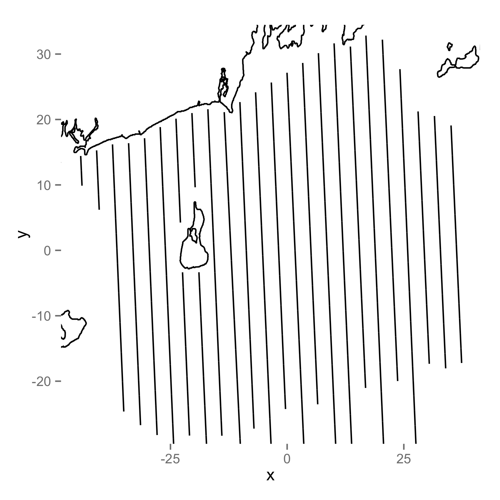

## Data setup 

## Some "problems"

  * How to model covariate effects?
  * Model (term) selection
  * Reponse distribution
  * Uncertain detection
  * Availability
  * Autocorrelation

##

Density surface models

## How do we deal with detectability?

  * Distance sampling! -- Fit detection functions
  * Estimate $\mathbb{P}(\text{ detection } | \text{ object at distance } x) = g(x)$ 
  * Calculate average detection probability = $\frac{1}{w}\int_0^w g(x) \text{ d}x$        (where $w$ is truncation distance)

&nbsp;

&nbsp;

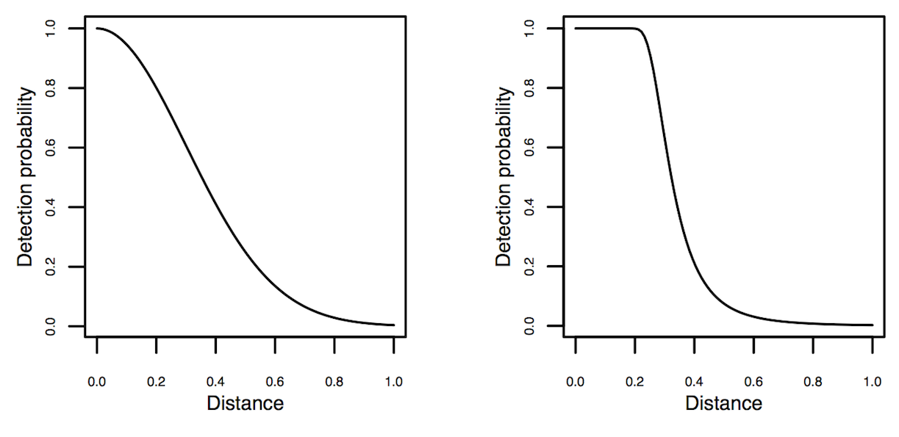

## Distance sampling

  * Lots of other stuff going on here!
  * Covariates that affect detectability
  * Double observer ($g(0)<1$)
  * Detection function formulations

&nbsp;

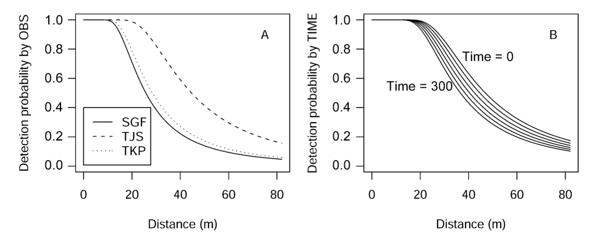

## Distance sampling software

  * Distance for Windows (6.2 out soon!)
     - Easy to use Windows software
     - Len Thomas, Eric Rexstad, Laura Marshall 
  * `Distance` R package
     - Simple way to fit detection functions
     - Me! 
  * `mrds` R package
     - More complex analyses - double observer surveys
     - Jeff Laake, me 

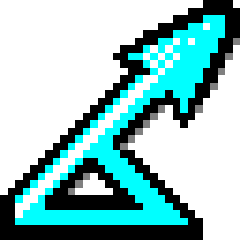

## Two pages generalized additive models (I)

$$
\mathbb{E}(n_j) = \exp \left\{ \beta_0 + \sum_k f_k(z_{jk}) \right\}
$$

  * $n_j$ has some count distribution (quasi-Poisson, Tweedie, negative binomial)
  * $f_k$ are *smooth* functions (splines $\Rightarrow f_k(x)=\sum_l \beta_l b_l(x)$)
  * $f_k$ can just be fixed effects $\Rightarrow$ GLM
  * Add-in random effects, correlation structures $\Rightarrow$ GAMM

## Two pages generalized additive models (II)

Minimise distance between data and model while minimizing:

$$
\lambda_k \int_\Omega \frac{\partial^2 f_k(z_k)}{\partial z_k^2} \text{ d}z_k
$$

<h2>"just wiggly enough"</h2>

## Density surface models

Two options for response: 

<h2>$n_j$ - raw counts per segment</h2>

model offset = *effective area* ($\hat{p}_j A_j$)

&nbsp;

<h2>$\hat{n}_j$ - H-T estimate per segment</h2>

$$
\hat{n}_j = \sum_{\text{groups in segment } j} \frac{s_j}{\hat{p}_j}
$$

model offset = segment area

Limitation: covariates in the detection function

## Density surface models

"Count" model:

$$
\mathbb{E}(n_j) = A_j \hat{p}_j \exp \left\{  \beta_0 + \sum_k f_k(z_{jk}) \right\}
$$

&nbsp;

"Estimated count" model:

$$
\mathbb{E}(\hat{n}_j) = A_j \exp \left\{  \beta_0 + \sum_k f_k(z_{jk}) \right\}
$$

## The `dsm` package

  * Design "inspired by" ("stolen from") `mgcv`
  * Easy to build simple models, possible to build complex ones
  * Syntax example:

        model <- dsm(count ~ s(x,k=10) + s(depth,k=6),
                     detection.function,
                     segment.data,
                     observation.data,
                     family=negbin(theta=0.1))

  * Utility functions: variance estimation, plotting, prediction etc

##

Case study I - Seabirds in RI waters

## Case study I - Seabirds in RI waters

## RI seabirds - Aims

  * Wind development in RI/MA waters
  * Map of usage
  * Estimate uncertainty
  * Combine maps (Zonation)

<small>Photo by <a href="http://www.flickr.com/photos/jackanapes/44534740/in/photolist-4WfCm-5fGWY-5kcwt-gYsVe-gYsVf-rfrFy-wk8SY-Bbkf9-CJGoH-JAwGP-WnzZb-2KrNkj-3YEz3W-49jRDt-49jSgD-49jThH-4eYB5g-4f3AbJ-4iejaL-4iejgf-4nFVgg-4rqKb8-4znidm-4BSyxi-4BWPZw-4Dtb18-4DxqB5-4DxqMY-4EBCuB-4EGy24-4EGy8F-4ELPWu-4KM4T1-5byKfc-5dK7xM-5BmTVz-5GpYcr-5GpZw2-5MEqxV-5Pkq76-76qvBB-76qvNH-76uqKf-7qJ5CU-7v8iXi-7vngHz-dTvFyn-dN222q-dN1Nuj-8oFmQZ-8oFmXD/">jackanapes on flickr</a> (<a href="http://creativecommons.org/licenses/by-nc-nd/2.0/deed.en_GB">CC BY-NC-ND</a>)</small>

## RI seabirds - Detection function modelling 

## RI seabirds - Spatial covariates

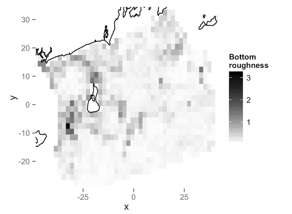

## RI seabirds - The model

  * Availability
     - correction factor from previous experimental work
     - $p_j \times \mathbb{P}(\text{available for detection})$
  * Term selection by approximate $p$-values
  * Covariates are collinear (curvilinear)
     - `select` - extra penalty
     - REML - better optimisation objective

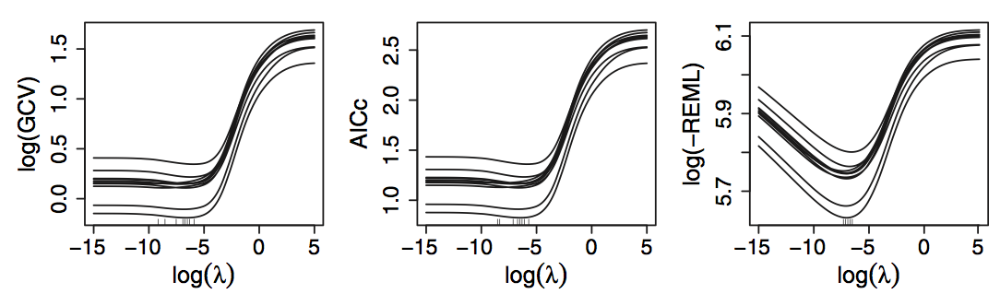

<small>From Fig. 1 of Wood (2011)</small>
 

## RI seabirds - Covariate effects

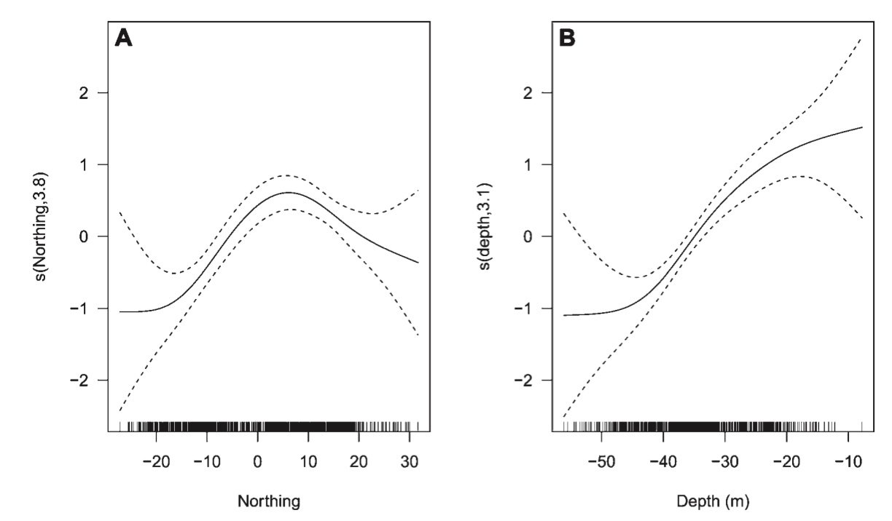

## RI seabirds - Results

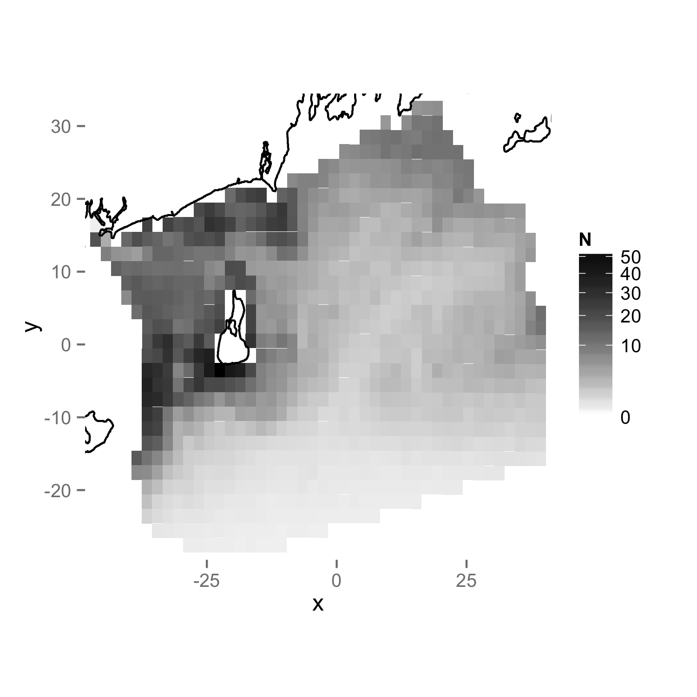

## RI seabirds - Uncertainty

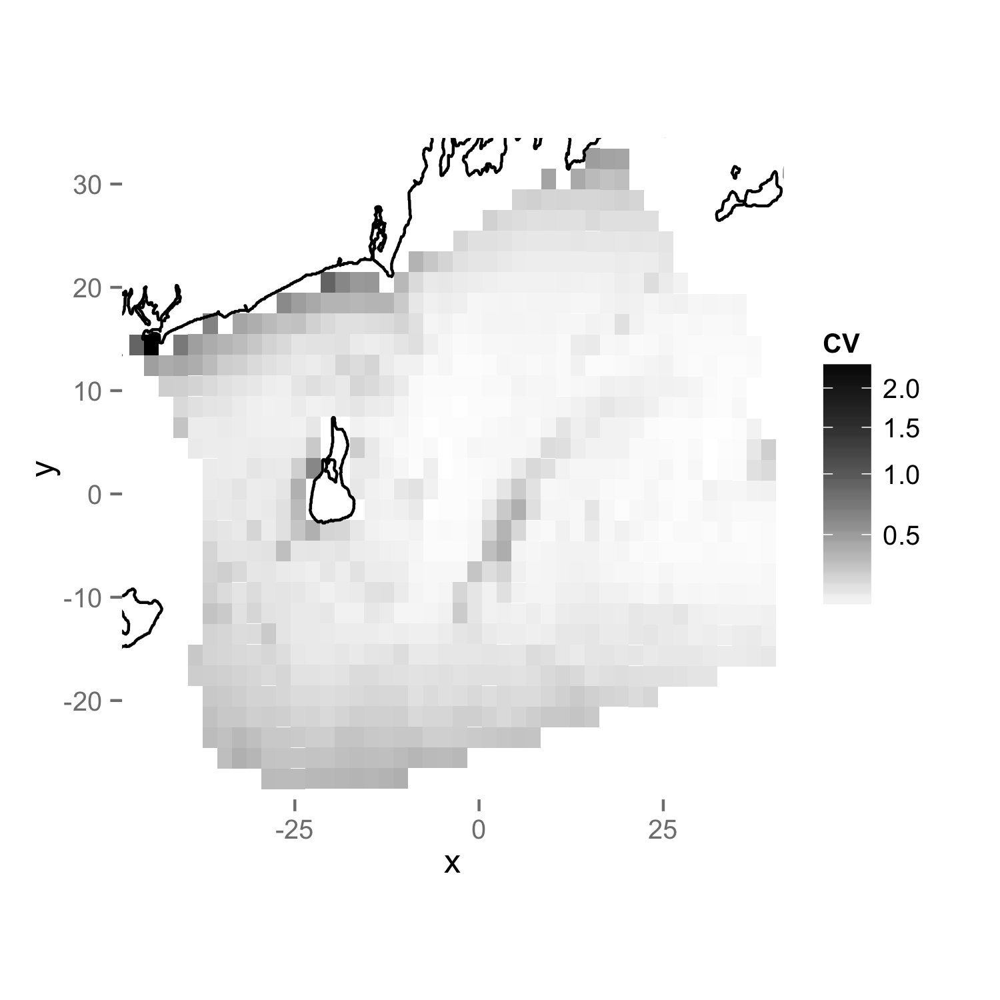

##

Case study II - black bears in Alaska

## Case study II - black bears in AK

  * Area of 26,482 km2 (~ size of VT/MA)
  * Double observer surveys using Piper Super Cubs
  * 1238, 35km transects, 2001-2003

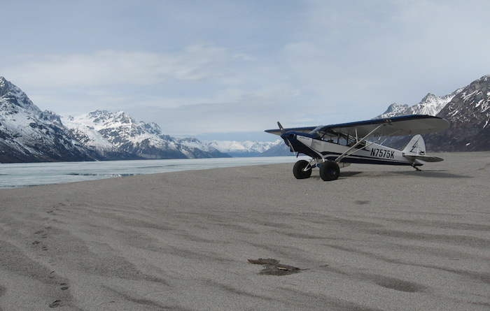

##

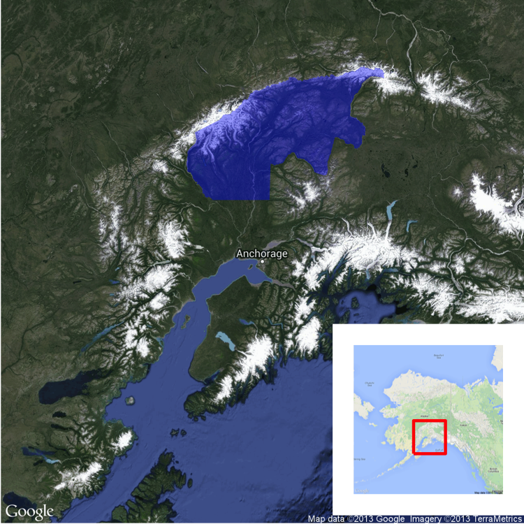

## 1238 transects

## Survey protocol

  * Surveys in Spring, bears are there, but not too much foliage
  * Generally search uphill
  * Double observer (Borchers et al, 2006)
  * Curtain between pilot and observer; light system
  * Go off transect and circle to ID

## Black bears

  * Truncate at 22m and 450m, leaving 351 groups (out of ~44,000 segments)
  * Group size 1-3 (lone bears, sow w. cubs)
  * 1402m elevational cutoff

## {.cover}

## {.cover}

## {.cover}

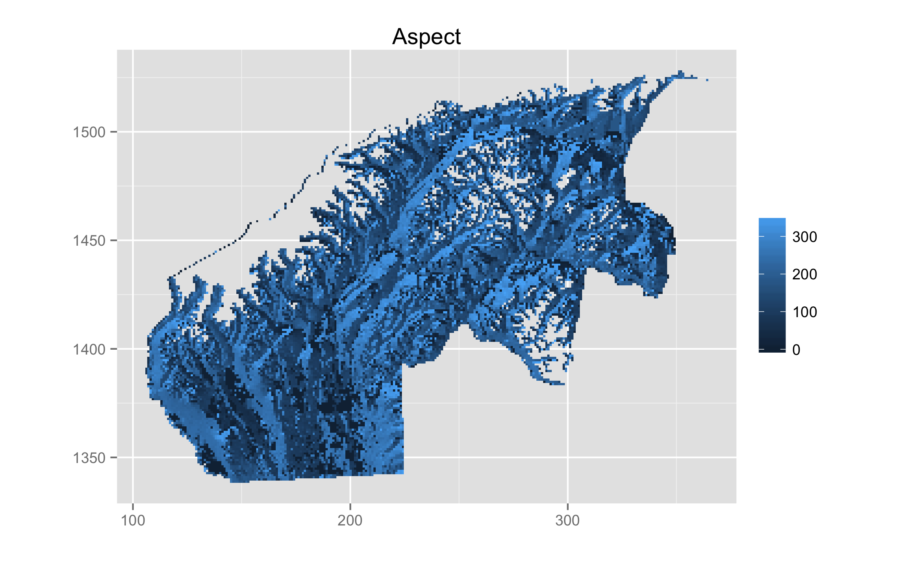

## {.cover}

## {.cover}

## {.cover}

## Final model

  * bivariate smooth of location
  * smooth of elevation
  * bivariate smooth of slope and aspect

&nbsp;

 

## 

## 

## Abundance estimate for GMU13E

  * MRDS estimate: ~1500 black bears
  * DSM estimate: ~1200 black bears (968 - 1635, CV ~13%)
  * Not a *huge* difference, so why bother?

## Abundance map

## CV map

## Conclusions

  * Flexible spatial models
     - GLMs + random effects + smooths + other extras
     - autocorrelation can be modelled
  * Large areas, makes sense
  * Spatial component is v. helpful for managers
  * Two-stage models can be useful!
  * Estimating temporal trends

## References

  * Borchers, DL, JL Laake, C Southwell, and CGM Paxton. Accommodating Unmodeled Heterogeneity in Double‐Observer Distance Sampling Surveys. Biometrics 62, no. 2 (2006): 372–378.
  * Miller, DL, ML Burt, EA Rexstad and L Thomas. Spatial Models for Distance Sampling Data: Recent Developments and Future Directions. Methods in Ecology and Evolution 4, no. 11 (2013): 1001–1010.
  * Winiarski, KJ, ML Burt, Eric Rexstad, DL Miller, CL Trocki, PWC Paton, and SR McWilliams. Integrating Aerial and Ship Surveys of Marine Birds Into a Combined Density Surface Model: a Case Study of Wintering Common Loons. The Condor 116, no. 2 (2014): 149–161. 
  * Winiarski, KJ, DL Miller, PWC Paton, and SR McWilliams. A Spatial Conservation Prioritization Approach for Protecting Marine Birds Given Proposed Offshore Wind Energy Development. Biological Conservation 169 (2014): 79–88.

&nbsp;

Talk available at [http://dill.github.com/talks/duke-dsm/talk.html](http://dill.github.com/talks/duke-dsm/talk.html)

## Thanks

  * Rhode Island: Kris Winiarski, Peter Paton, Scott McWilliams
  * Alaska: Earl Becker, Becky Strauch, Mike Litzen, Dave Filkill
  * Elsewhere: Mark Bravington, Natalie Kelly, Eric Rexstad, Louise Burt, Len Thomas, Steve Buckland

 

## Randomised quantile residuals

  * Goodness of fit testing
  * Dunn, PK, and GK Smyth. Randomized Quantile Residuals. Journal of Computational and Graphical Statistics 5, no. 3 (1996): 236–244.
  * Back transform for **exactly** Normal residuals
  * Less problems with artefacts
  * (Thanks to Natalie Kelly at CSIRO for the tip)

## `gam.check`

## `rqgam.check`

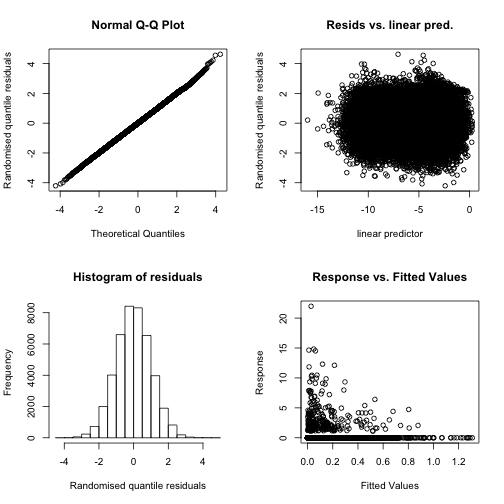

