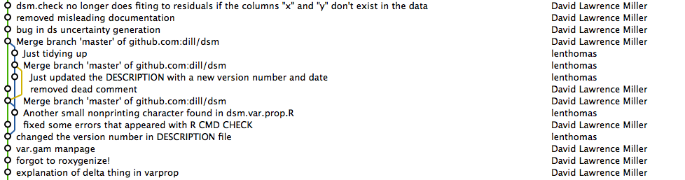

`fork`-ing, `merge`-ing and `branch`-ing in `git`
=================================================

David L. Miller (University of Rhode Island)

St Andrews R user group talk

20 December 2012

# outline

 * `git` re-cap
 * branches (and how to think about them)
 * merging
 * deleting branches
 * `stash`ing

# why `git`?

 * `git` is the Delorean from *Back to the Future*
 * time travel! (no roads required)
 * `<<extended metaphor>>`


# re-cap
 let's start with a fresh `git` repo

```
$ mkdir ex
$ cd ex
$ git init
$ touch README
$ git add README
$ git commit -a -m "frivolous commit"
```

# why branches?
 - contexts!
 - want to test some code but not screw other things up?
 - save results from different parameters
 <div align="center"></div>

# branch example (1)

Let's make a file called `row.max.R`:

```
# find the maximum in each row of a matrix -- slowly
row.max <- function(x){

  result <- c()

  for(i in 1:nrow(x)){
    this.max <- max(x[i,])
    result <- c(result, this.max)
  }
  return(result)
}
```


# branch example (2)

This does what you expect

```
> source("row.max.R")
> row.max(matrix(1:9,3,3))
[1] 7 8 9
```

Yay! It works!

```
$ git add row.max.R
$ git commit -a -m "Brian Ripley would be proud"
```

# branch example (3)

 * But wait, I heard about this thing called `apply()`...
 * What if that's better?
 * How do I try that out without angering other people on my project?
 * `branch`!

# branch example (4)

First make a new branch and switch to it:

```
$ git branch apply
$ git checkout apply
Switched to branch 'apply'
```

You can check which branch we're on using:

```
$ git branch
* apply
  master
```

# branch example (5)

Change the code:

```
# find the maximum in each row of a matrix
row.max <- function(x){
  return(apply(x,1,max))
}
```

Try it:

```
> source("row.max.R")
> row.max(matrix(1:9,3,3))
[1] 7 8 9
```

Hurrah!


# branch example (5)

Now, we can commit our changes to this branch

```
$ git commit -a -m "now we use apply(), this is much better"
```

we can switch back and forth between the branches and check where we are:

```
$ git checkout master
$ git branch
* master
  apply
$ git checkout apply
$ git branch
  master
* apply
```

# branching - when is it useful?
 * multiple sim results
 * want to check different parameter values
 * need to be careful with results if you want to access them all at once
 <div align="center"></div>

# (aside) I started this, but I hate it

nuke everything that's not committed

```
$ git reset --hard HEAD
```

(this works anytime, but be careful!)

# I have lots of branches -- what's next?

 <div align="center"></div>


# merging -- very easy
 say we prefer `apply`, how do we make that our new `master`?

```
$ git checkout apply
$ git merge --strategy=ours master
$ git checkout master
$ git merge apply
```

# merging -- easy

 if changes are disjoint we *fast-forward*

```
$ git commit -a -m "some changes"
$ git checkout master
$ git merge apply
```


# merging -- hard

 what if there were non-trivial changes?

 attempt merge as before, BUT get this error:

```
CONFLICT (content): Merge conflict in yourfile.R
Automatic merge failed; fix conflicts and then commit the result.
```

 find conflicting files with `git status`

 then, in file:

```
 <<<<<<< HEAD:mergetest
 some code here
 =======
 this is different code but in the same place...
 >>>>>>> 4e2b407f501b68f8588aa645acafffa0224b9b78:mergetest
```

delete what you don't want then `git commit -a`

# deleting branches

 To remove a local branch from your machine:

```
git branch -d the_local_branch
```

<div align="center"></div>


# remember: all changes are local

 push your new branch back to github

```
$ git push origin apply
```

 remove a remote branch:

```
git push origin :the_remote_branch
```

# reverting

 `checkout` the commit you want

```
$ git checkout e680ce8393934b0294268263074a0d4bd12ccf03
```

 time travel!

 SHA-1 is king

 github is a good GUI for finding hashes


# forking

 * instead of branching, if you don't have write access
 * "fork it"
 * copies repo to your github repos
 * then use a "pull request" to merge
 * all handled by github


# `git stash` for quick storage

 * working on something
 * need to do something else but don't want to commit
 * `stash` then come back to it
 * `HEAD` goes back to the last commit

# `stash` example

```
$ git stash save "work in progress"
# work on something else
$ git commit -a -m "fixed!"
$ git stash pop
# back to where we were
```


# end

<div class="background"></div>


