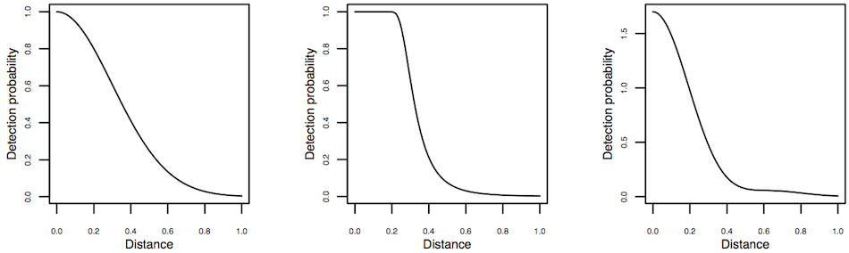
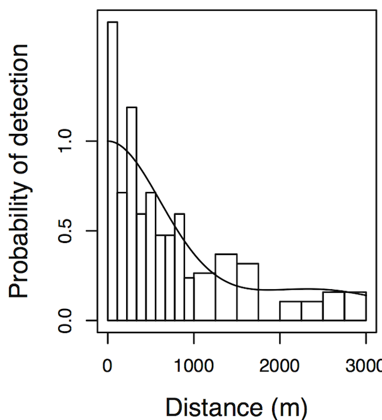
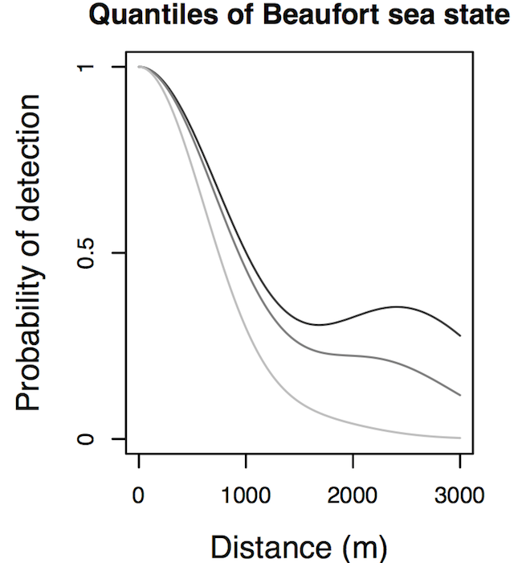
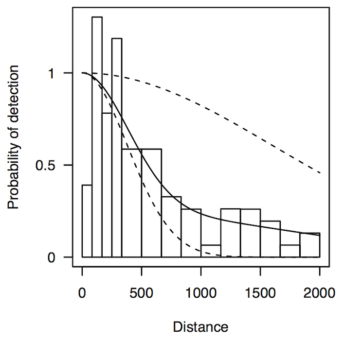

% Mixture model detection functions
% David Lawrence Miller (\& Len Thomas)
% CREEM, University of St Andrews


```{r knitr-setup, include=FALSE}
knitr::opts_chunk$set(cache=TRUE)
```


<div class="quote">Distance sampling</div>

## Distance sampling


## Detection functions

  * Essentially want to compute "correction factor"
  * Model $\mathbb{P} \left[ \text{animal detected } \vert \text{ object at distance } y\right] = g(y;\boldsymbol{\theta})$
  * Calculate the average probability of detection:

$$
P_a = \frac{1}{w} \int_0^w g(y;\boldsymbol{\theta}) \text{d}y
$$

  * Horvitz-Thompson-type estimators $\Rightarrow \hat{N}$


## Detection functions


## Criteria for detection functions

  1. flexible (*wide variety of shapes*)
  2. efficient (*few parameters)*
  3. flat at 0 distance (*detect what's in front of you)*
  4. monotonic non-increasing with increasing $y$ (*not easier to see far away things)*

## Key plus adjustment models

$$
g(y) = k(y)\left( 1+ \alpha_K(y)\right)
$$

| key  | $k(y)$   | adjustment | $\alpha_K(y)$ |
|---|---|---|---|
| uniform  | $1/w$   | cosine  | $\sum_{k=1}^K a_k \cos(k \pi y/w)$ |
| &nbsp; |  &nbsp; | Simple polynomial | $\sum_{k=1}^K a_k (y/w)^{2k}$ |
| half-normal  | $\exp\left(-\frac{y^2}{2 \sigma^2}\right)$ | cosine  | $\sum_{k=2}^K a_k \cos(k \pi y/w)$ |
|  &nbsp; | &nbsp; | Hermite polynomial | $\sum_{k=2}^K a_k H_{2k}(y/\sigma)$ |
| hazard-rate  | $1-\exp\left[-\left(\frac{y}{\sigma}\right)^{-b}\right]$ | cosine  | $\sum_{k=2}^K a_k \cos(k \pi y/w)$ |
|  &nbsp; | &nbsp; | Simple polynomial | $\sum_{k=2}^K a_k (y/w)^{2k}$ |


## K+A models

For example, a half-normal w. cosine adjustments
$$
g(y) = \exp\left(-\frac{y^2}{2 \sigma^2}\right) \left(1 + \sum_{k=2}^K a_k \cos(k \pi y/w)\right)
$$

  * Select number of adjustments ($K$) by forward-AIC
  * Estimate $\sigma$, $\{a_k\}$ by maximum likelihood
  * Can include covariates other than distance (see later)


## Detection functions




## &nbsp;


<div class="quote">Monotonicity</div>

## Example: Humpback whales


## Constrained optimisation

  * K+A models are not necessarily monotonic
  * check $g(y_i)\geq g(y_{i+1})$ and that $g(y_{i+1})\geq 0$ for $i=1,\ldots,M-1$
  * perform optimisation s.t. constraints
  * NLPQL (DISTANCE; Schittkowski, 1986) or SOLNP (`mrds`; Ye, 1987)
  * $M$++ $\Rightarrow$ computing time ++


## Software plug: `mrds:::check.mono`


## Covariate models

  * Including covariates in the detection function makes this worse
  * Observe covariates $\mathbf{z}_i$ for observation $i$
  * Affect detection via scale parameter

$$
\sigma_{i} = \exp\left( \beta_{0} + \sum_{k=1}^K \beta_k z_{ik}\right)
$$

  * Estimate ${\beta_k}$
  * Average detection per unique $\mathbf{z}_i$:

$$
p(\mathbf{z}_i) = \frac{1}{w} \int_0^w g(y,\mathbf{z}_i;\boldsymbol{\theta}) \text{d}y
$$

## 


## Monotonicity for covariate models

  * constrained optimisation not possible
  * too many combinations!
  * continuous covariates -- which values to check?
  * "hard" optimisation problem

## Example: Long-finned pilot whales (I)



## Example: Long-finned pilot whales (II)




## &nbsp;

<div class="quote">Mixture models</div>

## Mixture models


Sum of $J$ monotonic detection functions:

$$
g(y,\mathbf{z}; \boldsymbol{\theta}, \boldsymbol{\phi}) = \sum_{j=1}^J \phi_j g_j(y,\mathbf{z}; \boldsymbol{\theta}_j),
$$

$$
\text{where} \sum_j \phi_j = 1
$$

Letting $g$ be half-normal:

$$
g(y,\mathbf{z}; \boldsymbol{\theta}, \boldsymbol{\phi}) = \sum_{j=1}^J \phi_j \exp \Big( - \frac{y^2}{2\sigma_j(\mathbf{z})^2} \Big).
$$

Any sum of monotone functions is a monotone function


## &nbsp;

<div class="quote">How do mixtures do?</div>


## Revisit: Humpback whales (`mrds`)


## Revisit: Humpback whales (`mmds`)




## Revisit: Long-finned pilot whales (`mrds`)


## Revisit: Long-finned pilot whales (`mrds`)


## Revisit: Long-finned pilot whales (`mmds`)


## In practice

  * Include mixtures as a candidate model
  * Select number of components by AIC
  * Compare with K+A via AIC as usual
  * (Large simulation showed good results vs. `mrds`)

## 

<div class="quote">Conclusions</div>

## 
 <div class="quote">monotonicity can cause problems</div>

## 
<div class="quote">you might not realise

that there are problems</div>

## 
 <div class="quote">Paper submitted to PLoS ONE</div>

## 
 <div class="quote">R package on CRAN -- `mmds`</div>


## References


Pike, D G, T Gunnlaugsson, A G Vikingsson, G Desportes, and B Mikkelson. An Estimate of the Abundance of Long-Finned Pilot Whales Globicephala Melas From the NASS-2001 Shipboard Survey, North Atlantic Marine Mammal Commission (NAMMCO) Scientific Committee Working Group on Abundance Estimates, 2003.

Schittkowski, K. NLPQL: a Fortran Subroutine for Solving Constrained Nonlinear Programming Problems. Annals of Operations Research 5 (1986): 485–500.

Williams, R, and L Thomas. Distribution and Abundance of Marine Mammals in the Coastal Waters of British Columbia, Canada. Journal of Cetacean Research and Management 9, no. 1 (2007): 15.

Ye, Y. Interior Algorithms for Linear, Quadratic, and Linearly Constrained Convex Programming. Stanford University, 1987.


## Acknowledgements

  * Humpback data from Rob Williams \& Raincoast Conservation Foundation.
  * Long-finned pilot whale data (NASS-2001) from Daniel Pike, Gísli Vikingsson and Bjarni Mikkelsen at the Marine Research Institute, Iceland.


## Thanks!


<div class="quote">Talk available at:

[converged.yt/talks/ncsu-mixtures/talk.html](http://converged.yt/talks/ncsu-mixtures/talk.html)
</div>


## Constraining mixture proportions

  * Due to David Borchers
  * Estimate $\alpha_p$ rather than $\phi_j$

$$
\phi_j = F(\sum_{p=1}^j e^{\alpha_p}) - F(\sum_{p=1}^{j-1} e^{\alpha_p}) \qquad \text{for } 1\leq j \leq J-1
$$

and

$$
\phi_J = 1-\sum_{j=1}^{J-1} \phi_j
$$

  * $F$ is any continuous CDF on $(0,\infty]$ ($\Gamma(3,2)$)
  * $\exp$ ensures $e^{\alpha_p}\geq0$ $\Rightarrow \alpha_p \in \mathbb{R}$
  * $\sum \Rightarrow$ ordered the $\phi_j$
  * CDF ensures that the $\phi_j$s sum to $1$.

## Constraining mixture proportions


