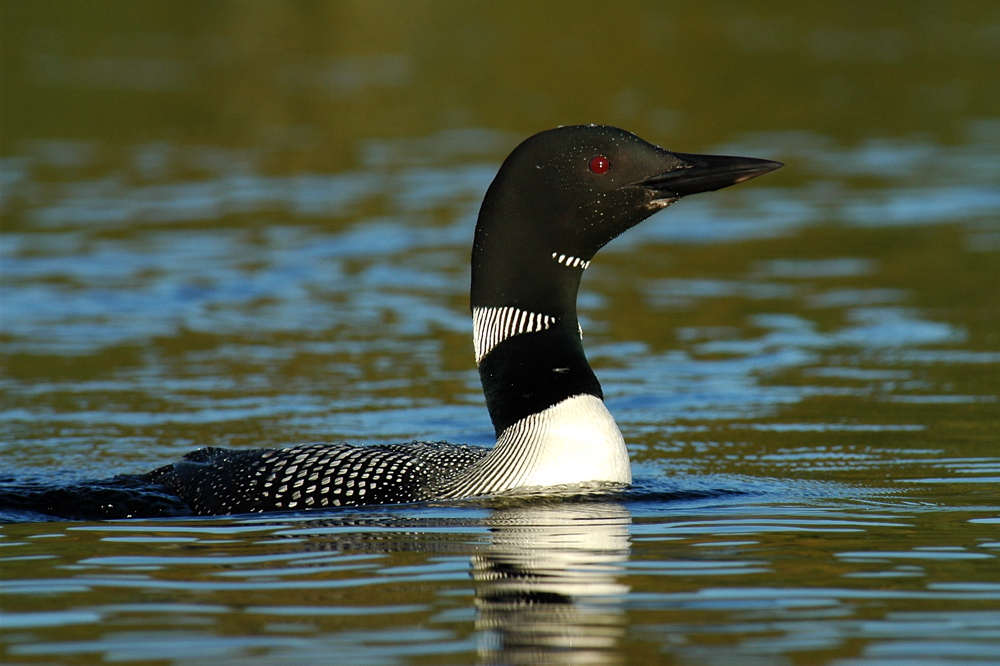
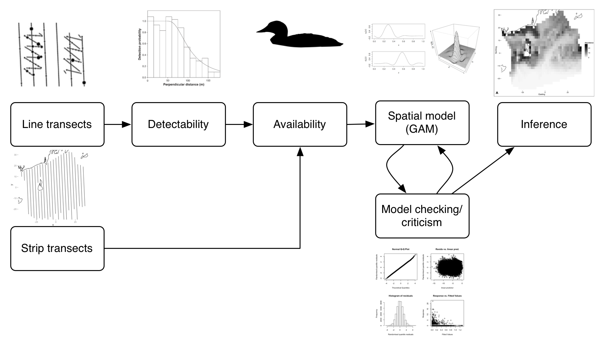
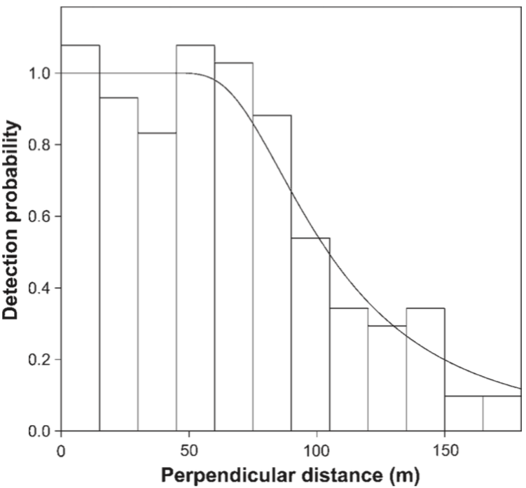
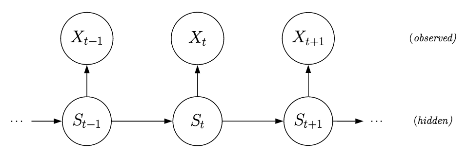
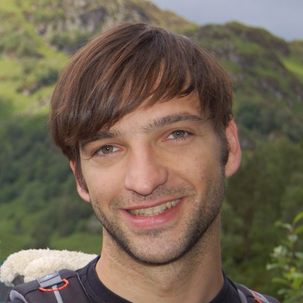
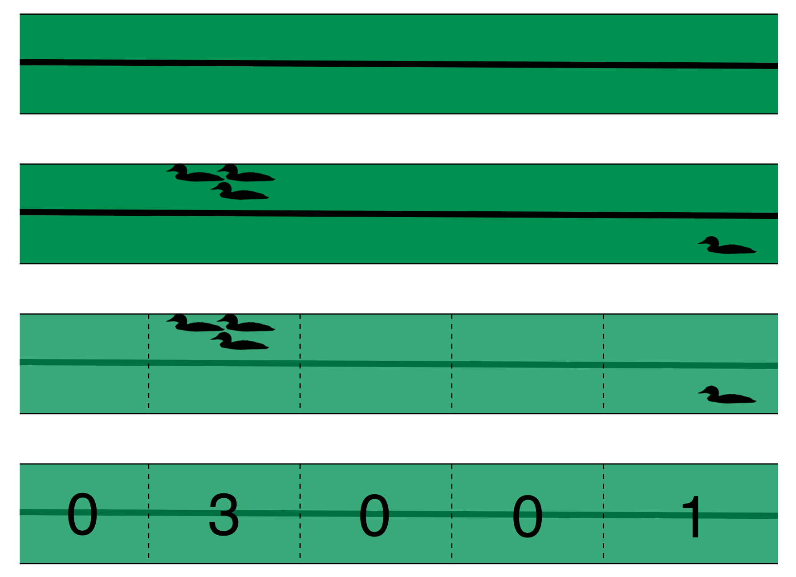
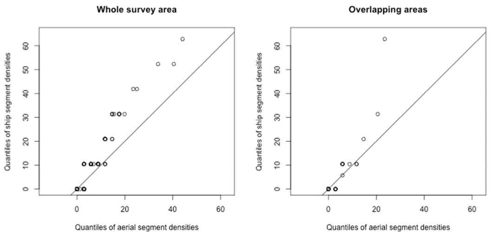

##

<big>Spatial models integrating two survey platforms</big>  
David L Miller CREEM, University of St Andrews 
[converged.yt](http://converged.yt)  
National Oceaonographic and Atmospheric Administration<small> 
Visual and Passive Acoustic Data Integration Modeling Workshop 
Woods Hole, Massachusetts 
15 September 2015</small>
 
 
 
 

## This talk

  * Some practical issues
  * Rhode Island case study
  * Not much model detail (but do ask me about this!)
  * More about "model independent" checking
  * Diagnostics etc

##

Case study: Common loons in Rhode Island

## A common loon (*Gavia immer*)

<small>Photo by <a href="http://www.flickr.com/photos/jackanapes/44534740/in/photolist-4WfCm-5fGWY-5kcwt-gYsVe-gYsVf-rfrFy-wk8SY-Bbkf9-CJGoH-JAwGP-WnzZb-2KrNkj-3YEz3W-49jRDt-49jSgD-49jThH-4eYB5g-4f3AbJ-4iejaL-4iejgf-4nFVgg-4rqKb8-4znidm-4BSyxi-4BWPZw-4Dtb18-4DxqB5-4DxqMY-4EBCuB-4EGy24-4EGy8F-4ELPWu-4KM4T1-5byKfc-5dK7xM-5BmTVz-5GpYcr-5GpZw2-5MEqxV-5Pkq76-76qvBB-76qvNH-76uqKf-7qJ5CU-7v8iXi-7vngHz-dTvFyn-dN222q-dN1Nuj-8oFmQZ-8oFmXD/">jackanapes on flickr</a> (<a href="http://creativecommons.org/licenses/by-nc-nd/2.0/deed.en_GB">CC BY-NC-ND</a>)</small>

## OSAMP

  * Ocean Special Area Management Plan
  * Windfarm development nr. Block Island
  * Part of state-wide EIA
  * Potential pre-impact survey

## {.cover}

## Rhode Island Surveys

  * 2 platforms
  * Ship-based surveys
    * 8 grids of zig-zag randomly located
    * 10 days -- 2 December 2009 - 13 February 2010
    * Single observer distance sampling
  * Aerial surveys
    * 24 transects
    * 9 days -- 2 December 2009 - 22 February 2010
    * Strip transects

##

##

How do we integrate this data?

## Considerations

  * Detectability
  * Availability
  * Effort
  * Overlap (temporal and spatial)
  * Variance estimation

##

Density surface models

. . .

 (Spatial models that account for detectability)

. . .

  (...and more)

## $\geq 2$-stage models {.cover}

 
 
 

<small>Hedley and Buckland (2004). Miller et al (2013).</small>

##

Detectability

## Distance sampling - line transects

<small>Code for animation at <A href="https://gist.github.com/dill/2b0c120d5484d338d8ef">https://gist.github.com/dill/2b0c120d5484d338d8ef</a></small>

## Detection functions

## Detection functions

$\mathbb{P} \left[ \text{animal detected } \vert \text{ animal at distance } y\right]$

Integrate out distance:
$$
\hat{p}_i = \frac{1}{w} \int_0^w g(y; \boldsymbol{\hat{\theta}}, z_i) \text{d}y
$$

##

or...

##

$p=1$

##

Availability

## Availability correction

  * Simple correction
    * Ford & Gieg (1995) quantified diving habits in RI waters
  * More complicated stuff
    * Borchers, Langrock & co have many solutions using Hidden Markov Models
  * (Different for different platforms?)

 

##

Effort

## Data setup

<small><i>Gavia immer</i> from <a href="http://phylopic.org/image/ae2506e3-b97d-45d7-a3f9-1bfb1567e1b1/">PhyloPic</a>.</small>

## Effort

  * "Simple" here
  * Strip transects == line transects w. $p=1$ (nesting)
  * Always surveying surface (effort equivalence)
  * (More complex with different "types" of data)
  * (Need to find equivalency?)

##

Overlap

## Overlap

  * Ensure we're not combining apples and oranges
  * Are counts/unit effort reasonable?
  * Compare overlapping & non-overlapping areas
  * Quantile-quantile plots -- Kolmogorov-Smirnov tests (Cramer-von Mises?)
  * Sensitivity -- leave-$k$-out cross-validation

##

Spatially explicit models

## Spatial model

  * Generalized Additive Models (GAMs)

$$
\mathbb{E}(\hat{n}_j) = A_j\exp \left\{ \beta_0 + \sum_k f_k(z_{jk}) \right\}
$$

  * $\hat{n}_j \sim$ count distribution (raw or Horvtiz-Thompson estimate)
  * $f_k$ are *smooth* functions (splines $\Rightarrow f_k(x)=\sum_l \beta_l b_l(x)$)
  * $f_k$ can just be fixed effects $\Rightarrow$ GLM
  * Add-in random effects, correlation structures $\Rightarrow$ GAMM
  * $A_j$ is area of segment
  * R package `dsm`
  * Wood (2006) is a good intro to GAMs

 
 

##

Variance estimation

## Uncertainty propagation

  * Major criticism of $\geq2$-stage models
  * Uncertainty from detection function AND spatial model (and...)
  * Refit model with "extra" term -- zero mean effect, variance contribution
  * Williams et al (2011). Bravington, Hedley and Miller (in prep)

##

Conclusions

## Conclusions

  * Ensure that data are compatible *before* modelling
  * Equivalency in effort tricky for non-trivial cases
  * Two-stage models can be useful!
    * Distribute tasks
    * Modular model checking
  - Existing statistical framework (GAM)
  * Flexible spatial models
     - Detectability
     - GLMs + random effects + smooths + other extras
     - autocorrelation can be modelled
     - accounting for uncertainty

## Acknowledgements

  * St Andrews: Eric Rexstad, Louise Burt
  * Rhode Island: Kris Winiarski (now UMass), Peter Paton, Scott McWilliams, Carol Trocki
  * Funding State of Rhode Island for the Ocean Special Area Management Plan

## Thanks!

Slides available at [`converged.yt`](http://converged.yt/) 
 Course at Duke in October: [`nicholas.duke.edu/del/distance`](https://nicholas.duke.edu/del/distance)

## References

  * Borchers, DL, Zucchini, W, Heide-Jørgensen, MP, Cañadas, A, Langrock, R, Buckland, ST, & Marques, TA (2013). Using hidden Markov models to deal with availability bias on line transect surveys. Biometrics, 69(3), 703–713.
  * Ford, T. B., and J. A. Gieg (1995). Winter behavior of the Common Loon. Journal of Field Ornithology 66:22–29.
  * Miller, DL, ML Burt, EA Rexstad and L Thomas. Spatial Models for Distance Sampling Data: Recent Developments and Future Directions. Methods in Ecology and Evolution 4, no. 11 (2013): 1001–1010.
  * Williams, R, SL Hedley, TA Branch, MV Bravington, AN Zerbini, & KP Findlay (2011). Chilean Blue Whales as a Case Study to Illustrate Methods to Estimate Abundance and Evaluate Conservation Status of Rare Species. Conservation Biology, 25(3), 526–535.
  * Winiarski, KJ, ML Burt, Eric Rexstad, DL Miller, CL Trocki, PWC Paton, and SR McWilliams. Integrating Aerial and Ship Surveys of Marine Birds Into a Combined Density Surface Model: a Case Study of Wintering Common Loons. The Condor 116, no. 2 (2014): 149–161.
  * Wood, S. (2006). Generalized Additive Models. CRC Press. 

