
<big>Making better decisions about where to put stuff</big>  
David L Miller NOAA Northeast Fisheries Science Center, Woods Hole, MA 
[converged.yt](http://converged.yt)  
<small>NEFSC Webinar on Cetacean Spatial Analysis 
8 February 2016</small>
 
 
 
<!--
-->

##

Disclaimer: this talk is about birds

## Background

  - RI wanted to know what was in it's waters
    - Offshore energy development (windfarms)
    - Block Island development
    - "Area of mutual interest" w/ MA
  - OSAMP
    - Ocean Special Area Management Plan
    - NC/MA/NJ etc all have one
  - Basic question
    - "where should we build a windfarm?"

## A windfarm

[The Danish Vindmølleindustrien Middelgrunden wind farm of the coast of Copenhagen CC BY-NC 2.0](https://www.flickr.com/photos/danishwindindustryassociation/4269092626/)

##

Data and models

## Aerial line transect surveys

##

More species, more models (More problems)

## Density surface models

  - Modelling approach as SWFSC folks showed
  - Relate abundance or presence to smooth functions of covariates
  - Includes detectability, availability corrections
  - Produces spatially-explicit abundance estimates

## Some predictions

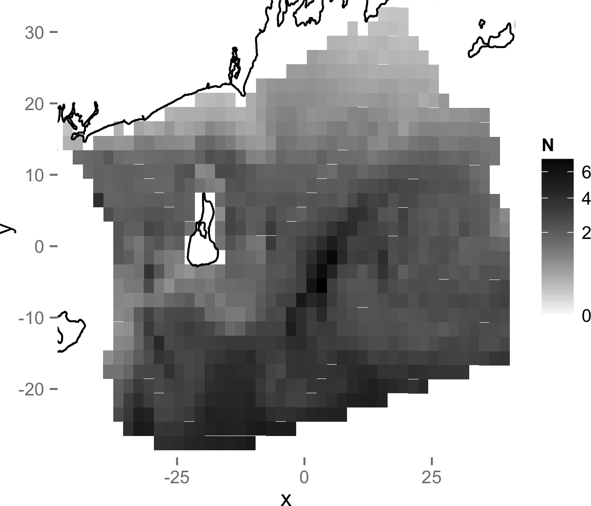

 

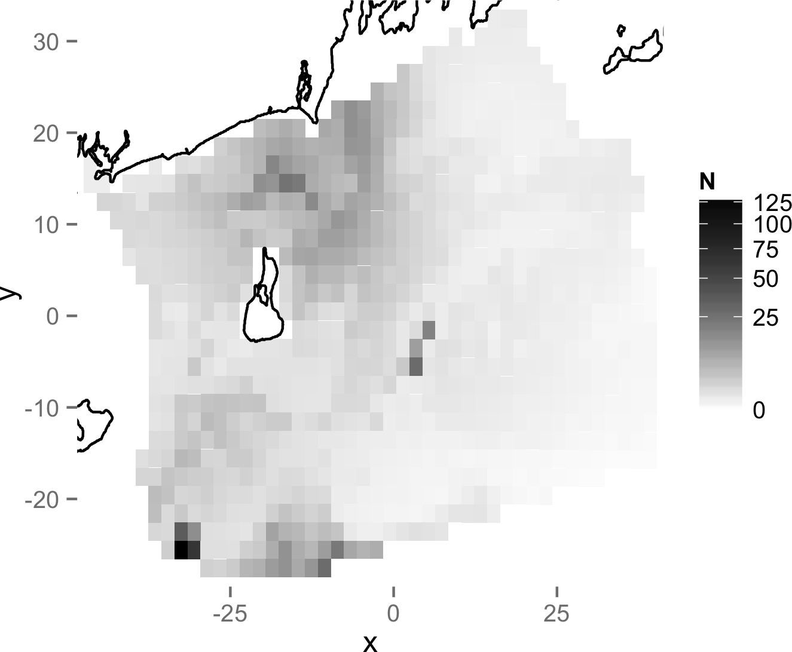
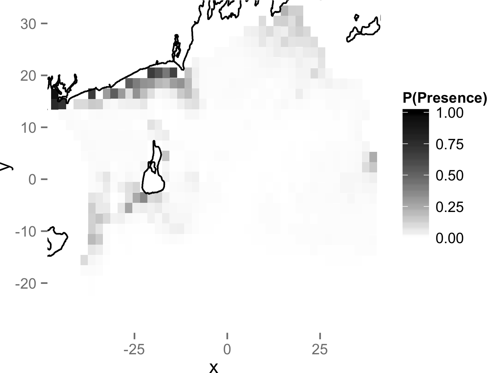
 
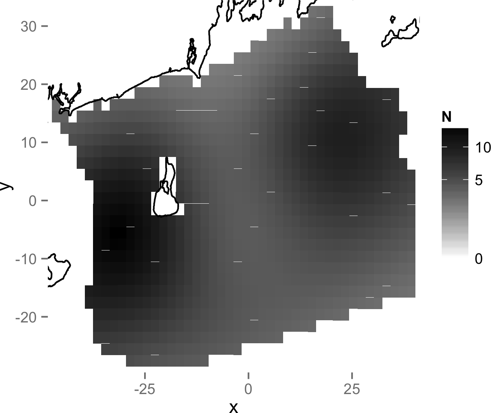

## Some uncertainty (CV)

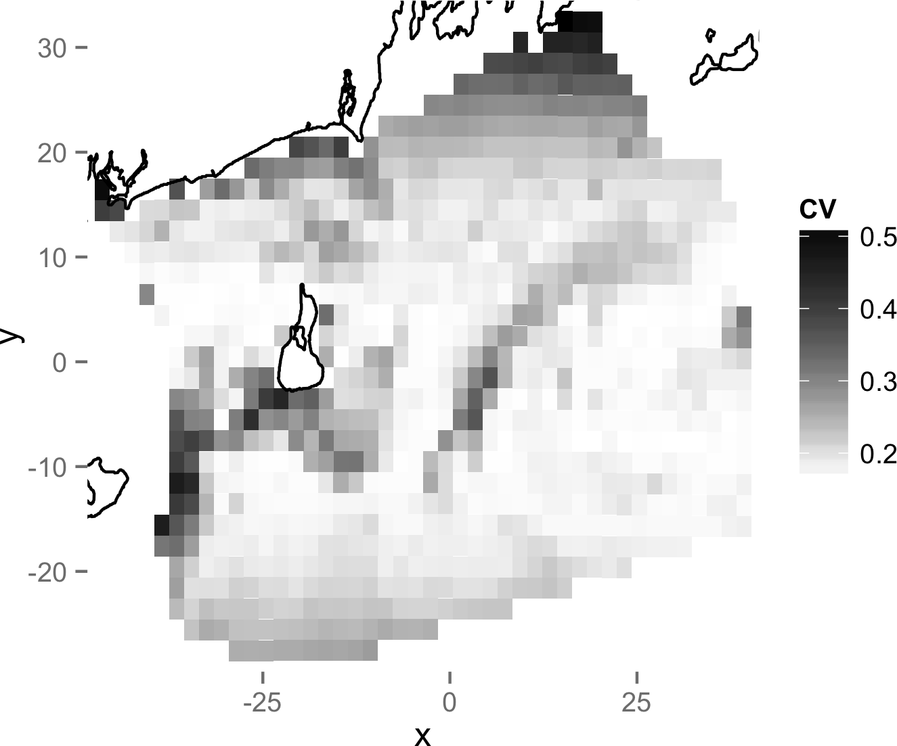

 

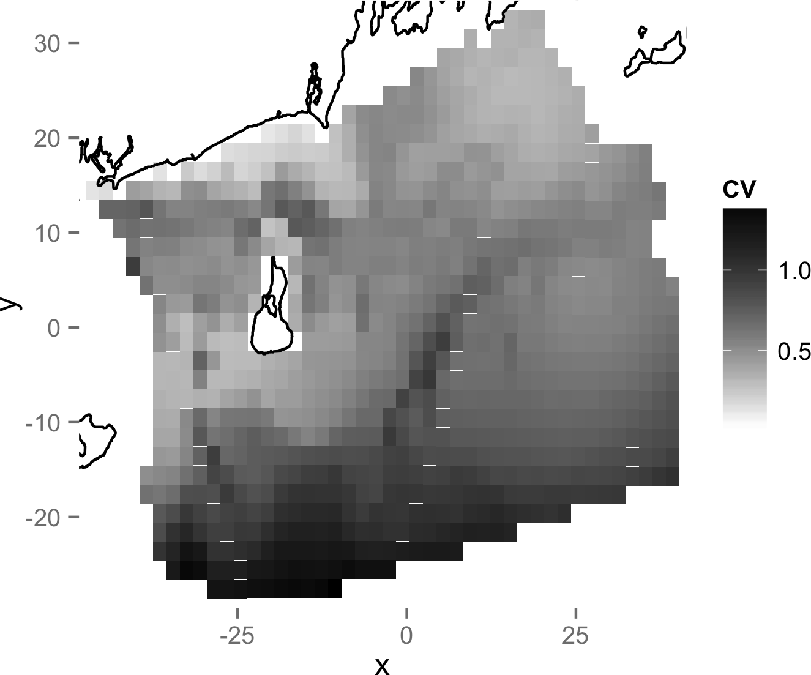
 

##

Okay, so what do we do?

## Combining information

  - Ecology and management are multidimensional
  - Not usually just one species to deal with
  - How can we combine information on multiple species?
  - Really want one number or one map to show folks

## Spatial prioritisation

  - "Where can we put stuff?"
  - Take grid cells, say which are of "high value"
  - Use model output (predictions) get "value" of areas
  - Many options (Wintle, 2008 review)

## Zonation

  - Put (prediction) maps together
  - Rank proportion of species lost per cell
    - Maximise biodiversity rank
    - Can weight by "conservation value"
    - Can weight for connectivity
  - Software from Helsinki U (Moilenen et al, 2005)
  * [http://cbig.it.helsinki.fi/software/zonation/](http://cbig.it.helsinki.fi/software/zonation/)
  - Maps don't have to use the same model "types"

##

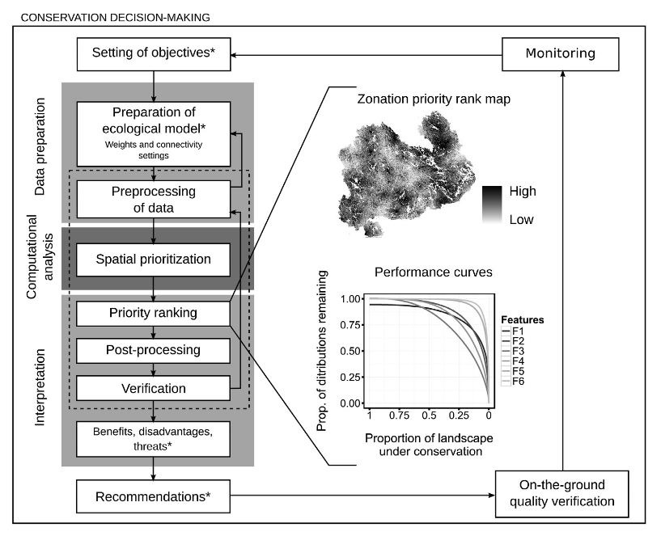

Figure 1 from Lehtomäki and Moilanen (2013) CC-BY 3.0

##

Zonation can answer the question: 
*"**where** should we do this?"* 
rather than just 
*"what happens if we do this **here**?"*

## Prioritization (weighted)

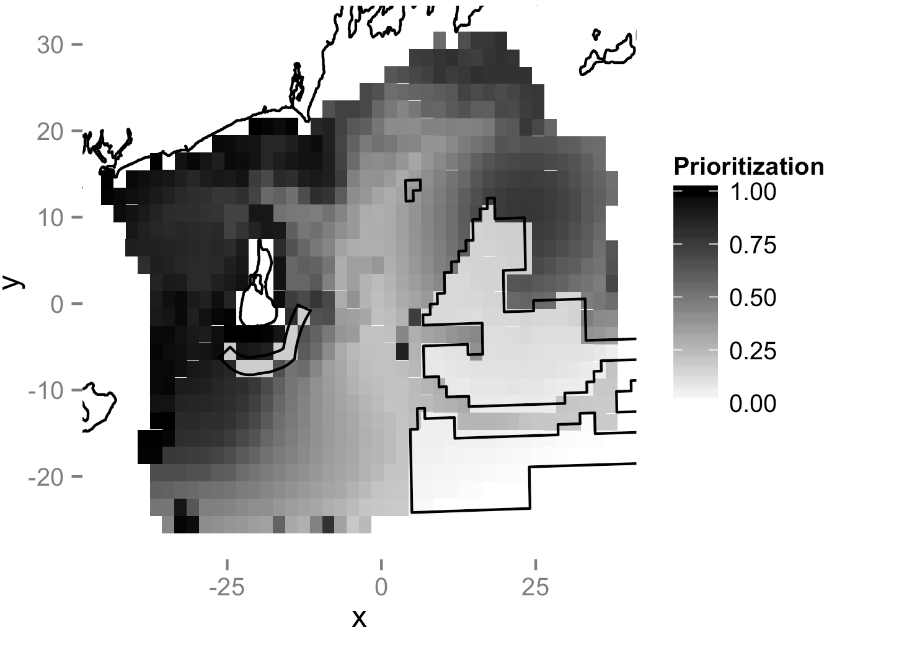
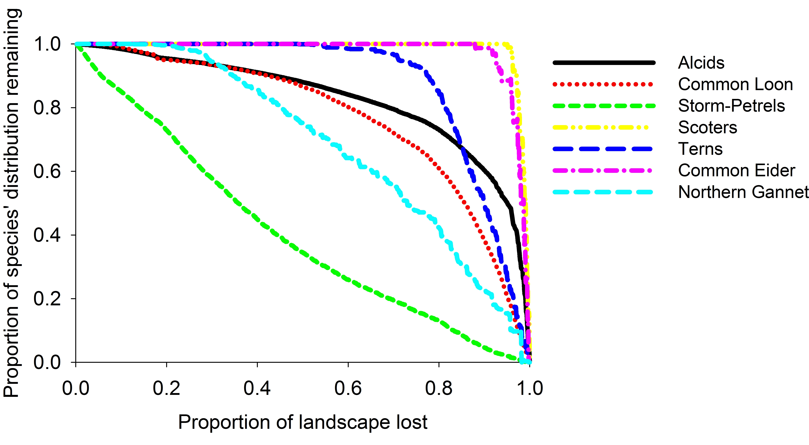

## NOAA map 13205

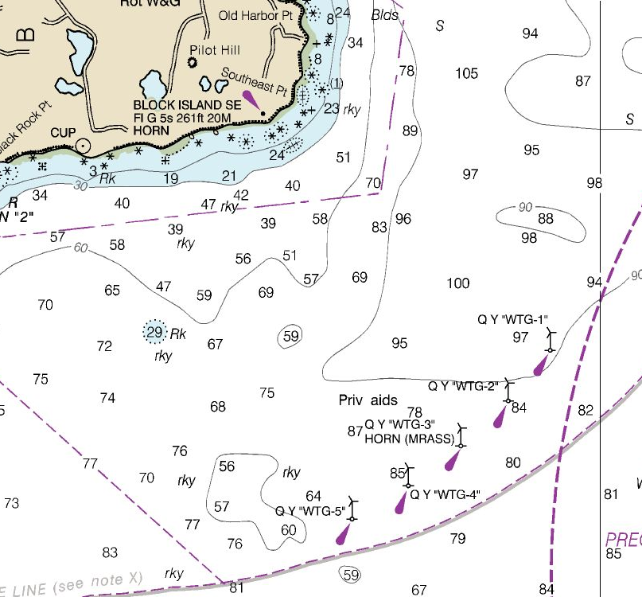

[http://www.charts.noaa.gov/OnLineViewer/13205.shtml](http://www.charts.noaa.gov/OnLineViewer/13205.shtml)

## Winiarski et al (2012)

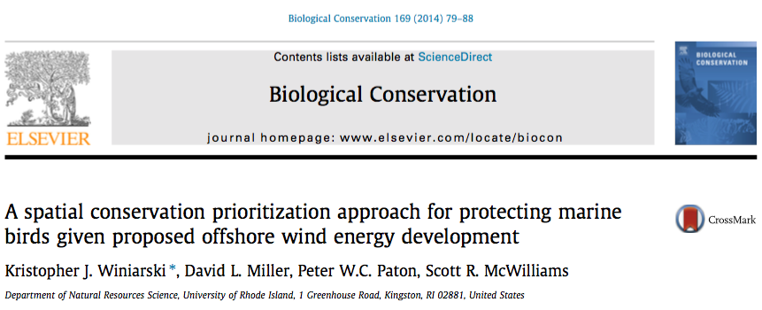

## Shortcomings

  - If your model is garbage, your prioritization will be too
  - Abundance gives the most information
    - Detection and availability corrected
  - Seasonal variation
  - No dynamics

  - Southern hemisphere competitor
    - MARXAN: [http://www.uq.edu.au/marxan/index.html](http://www.uq.edu.au/marxan/index.html)
    - Listed on the [NOAA Digital Coast tools site](https://coast.noaa.gov/digitalcoast/tools/marxan)

## Acknowledgements

  * University of Rhode Island: Kris Winiarski (now UMass), Peter Paton, Scott McWilliams
  * Work was funded by grants from the US Department of Energy, the American Recovery and Reinvestment Act, and the State of Rhode Island

## References

  * Lehtomäki, J and A Moilanen (2013). Methods and workflow for spatial conservation prioritization using Zonation. Environmental Modelling & Software 47, 128-137. http://dx.doi.org/10.1016/j.envsoft.2013.05.001.
  * Miller, DL, ML Burt, EA Rexstad and L Thomas (2013). Spatial Models for Distance Sampling Data: Recent Developments and Future Directions. Methods in Ecology and Evolution 4(11) : 1001–1010.
  * Moilanen, A, AMA Franco, RI Early, R Fox, B Wintle, CD Thomas (2005). Prioritizing multiple-use landscapes for conservation: methods for large multi-species planning problems. Proc. R. Soc. B 272 1885-1891; DOI: 10.1098/rspb.2005.3164.
 * Winiarski, KJ, DL Miller, PWC Paton, & SR McWilliams (2014). A spatial conservation prioritization approach for protecting marine birds given proposed offshore wind energy development. Biological Conservation, 169(C), 79–88. http://doi.org/10.1016/j.biocon.2013.11.004 [http://converged.yt/papers/Zonation_ms_081613.pdf](http://converged.yt/papers/Zonation_ms_081613.pdf)
  * Wintle, B.A. (2008). A review of biodiversity investment prioritization tools. A report to the Biodiversity Expert Working Group toward the development of the Investment Framework for Environmental Resources. [http://www.inffer.com.au/wp-content/uploads/2011/06/biod_tools.pdf](http://www.inffer.com.au/wp-content/uploads/2011/06/biod_tools.pdf).

