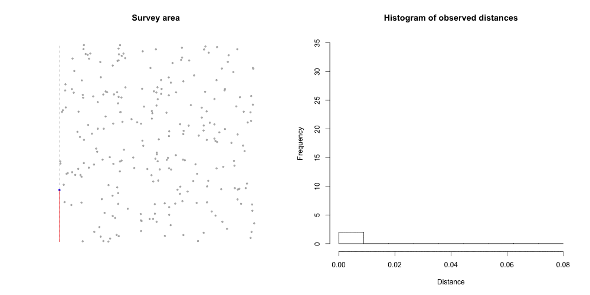
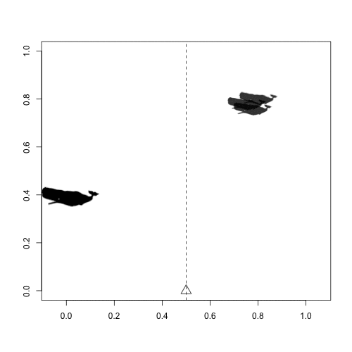

##

<p align="center"><big>Building ecological models bit-by-bit</big><br/><br/>
David L Miller<br/>CREEM, University of St Andrews<br/><br/>
<small>useR! 2015<br/>
Ålborg, Denmark<br/>
1 July 2015</small>
<br/>
<br/>
<br/>
<br/>
<br/>
<br/>
</p>

##

<div class="quote">Motivation</div>

##

<div class="quote">Ecological questions</div>

##

<div class="bigquote">How many animals are there?</div>

##

<div class="bigquote">How?</div>

##

<div class="quote">Statistical methods</div>

. . .

<div class="quote"><br/>(Usable by ecologists)</div>

##

<div class="quote">Software</div>
. . .

<div class="quote"><br/>(Usable by ecologists)</div>

## Current trends (biased sample)

  * Big (BIG) (Bayesian?) models
  * Encapsulate many processes
  * "Throw everything in and see what happens"
  * (Perceived) Workflow:
    1. Formulate a giant likelihood
    2. Wait for a long time
    3. ...
    4. Get results/diagnostics
    5. Optional: repeat (convergence/model checking fails)


## Anti-trends

  * $\geq 2$ stage modelling
    * Optimality issues either way?
    * Propagation of uncertainty "hard"?
  * Thorough model checking
  * Fitting non-complicated models
    * (Many simple vs. one giant)

## Proposal

  * Easier to understand (process-based)
  * Simplification of workflow
  * Less time waiting (and shorter waits)
  * Diagnostics as we go
  * Let's do more of this!


##

<div class="quote">Case study:<br/>distance sampling</div>


## Distance sampling (in 1 slide)



<small>Code for animation at <A href="https://gist.github.com/dill/2b0c120d5484d338d8ef">https://gist.github.com/dill/2b0c120d5484d338d8ef</a></small>

## Modelling detection

  * Model $\mathbb{P} \left[ \text{animal detected } \vert \text{ object at distance } y\right] = g(y;\boldsymbol{\theta})$
  * Calculate the average probability of detection:

$$
\hat{p}_i = \frac{1}{w} \int_0^w g(y; \mathbf{z}_i, \boldsymbol{\hat{\theta}})  \text{d}y
$$

  * Horvitz-Thompson-type estimators:

$$
\hat{N} = \sum_{i=1}^n \frac{s_i}{\hat{p}_i}
$$

  * (or model-based estimators see Miller et al (2013))

## Detection function


## Mark-recapture distance sampling

  * Buckland et al (2004), Borchers et al (1998)
  * DS assumes $g(0)=1$ (i.e. see everything right infront of you)
  * Use 2 observers, set up trials
  * Add an extra likelihood *component*, account for this
    * binomial, mark-recapture

<div class="quote">
$$
\mathcal{L} = \mathcal{L}_g \mathcal{L}_\Omega
$$
</div>

## Mark-recapture distance sampling animation



<small>Code for animation at <A href="https://gist.github.com/dill/2b0c120d5484d338d8ef">https://gist.github.com/dill/2b0c120d5484d338d8ef</a></small>


##

<div class="quote">Partition in likelihood == partition in software</div>


## Syntax example

```r
library(Distance2)
# MR model
mr.io <- mrds(data, truncation=4,
              model=mr(mode="io", formula=~distance))
## do checking of mr part

# DS model
ds1 <- ds(data, truncation=4)
## do checking of ds part

# "add" them together
mrds.io <- mr.io + ds1
```

##

<div class="bigquote">`+` is a really useful operator</div>


## Let `+` do the work

  * define `+.class`
  * let `+` compute the resulting components
    * likelihood
    * AIC
    * update classes/functions (`summary`, `predict` etc)
  * clearer interface for users
    * (likelihood components add on log scale)

<small>"Inspired" ("stolen") from `ggplot2`</small>

## Can we do this for other model classes?

  * Distance sampling good for this
    * Componentised likelihoods (thanks to David Borchers)
  * What about other models?
    * Where (conditional) independence is not required
    * Just using `+` to "add" components

## Something like...?

```{r}
# linear model
mod <- lm(response ~ x1, data=data)
mod <- mod + lm_var(x2)
```

less trivially

```{r}
# include correkation structure in nlm
mod <- nlm(response ~ x1, data=data)
mod_AR1 <- mod + corAR1(form=~sample|group)
```

<small>Refit using `nlm` starting parameters? See also `update`.</small>


## Conclusion

  * Do folks think this kind of thing is useful?
    * In which areas is it useful?
  * Avoid optimality issues by refitting "full" model at end?
  * Encourage users to perform model checking?
  * Don't just fit the most complicated model?
    * Mark Brewer "Cult of AIC" talk


## Thanks!

<div class="quote">Talk available:<br/><a href="http://converged.yt/talks/useR2015/talk.html">http://converged.yt/talks/useR2015/talk.html</a></div>


## References

  * Buckland, S. T., Anderson, D. R., Burnham, K. P., Laake, J. L., Borchers, D. L., & Thomas, L. (2001). Introduction to Distance Sampling. OUP.
  * Buckland, S. T., Anderson, D. R., Burnham, K. P., Laake, J. L., Borchers, D. L., & Thomas, L. (2004). Advanced Distance Sampling. OUP.
  * Borchers, D. L., Buckland, S. T., Goedhart, P. W., Clarke, E. D., & Hedley, S. L. (1998). Horvitz-Thompson Estimators for Double-Platform Line Transect Surveys. Biometrics, 54(4), 1221. http://doi.org/10.2307/2533652
  * Borchers, D. L., Buckland, S. T., & Zucchini, W. (2002). Estimating Animal Abundance: Closed populations. Springer.
  * Miller, D. L., Burt, M. L., Rexstad, E. A., & Thomas, L. (2013). Spatial models for distance sampling data: recent developments and future directions. Methods in Ecology and Evolution, 4(11), 1001–1010. http://doi.org/10.1111/2041-210X.12105


