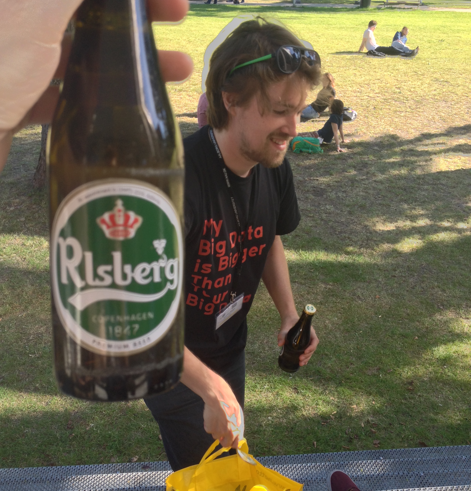
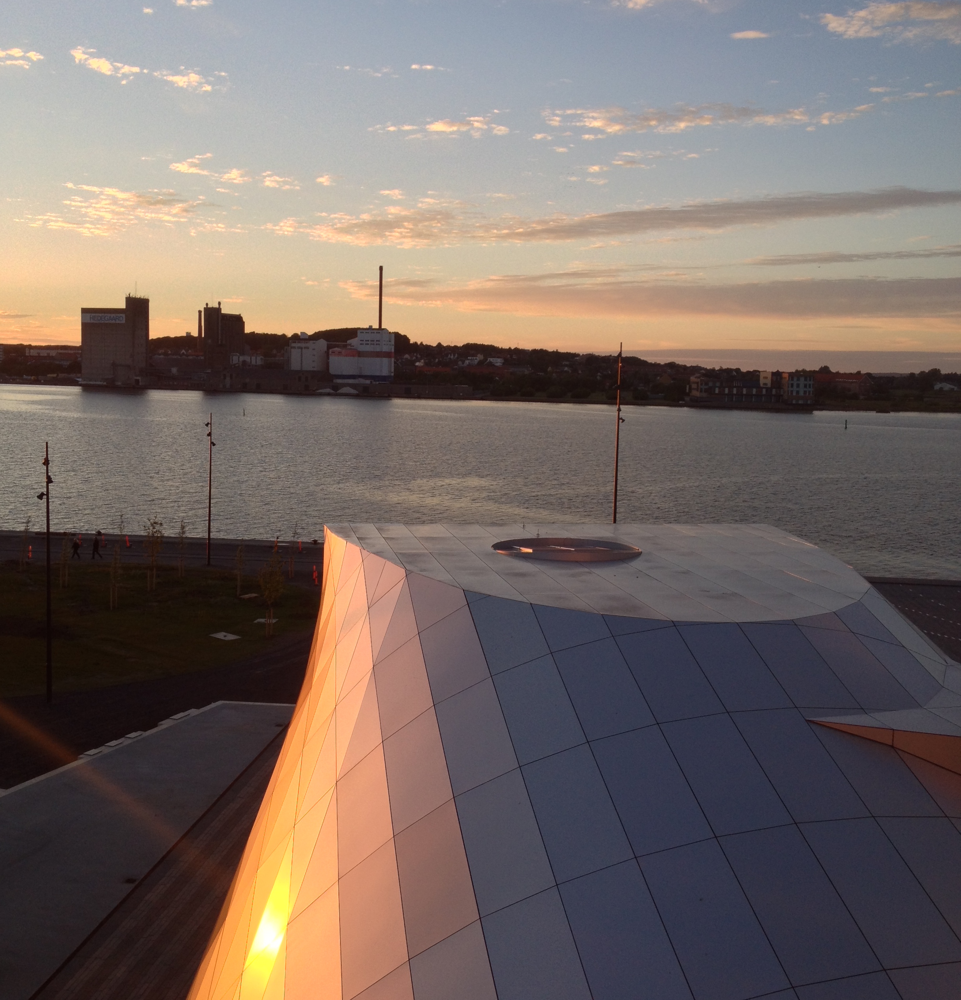

##

<big>useR! 2015 highlights</big>  
David L Miller  
CREEMcrackers<small> 
CREEM, University of St Andrews 
31 July 2015</small>
 
 
 
 
 

#

General thoughts

# useR! 2015 in general

  * Still a weird (in a good way) conference
  * Huge range of talks
  * Standard of talks much higher than in previous years
  * [Complete list of talks, some with slides online](http://user2015.math.aau.dk/oral_sessions)

#

Talks I attended

# `archivist`: Tools for Storing, Restoring and Searching for R Objects

  * Przemysław Biecek, University of Warsaw
  * During analysis we create "artifacts" -- subsets, aggregations, plots, models $\Rightarrow$ `git`
  * `archivist` stores the artifacts and *relations between* them (if you use pipes `%a%`)
  * tags are generated from `ggplot2` plots from labels, can be added for others
  * [pbiecek.github.io/archivist/](http://pbiecek.github.io/archivist/)

# Manipulation of Discrete Random Variables in R with `discreteRV`

  * Eric Hare, Iowa State University
  * Bridge the gap between maths and R
  * [Paper](http://journal.r-project.org/archive/2015-1/hare-buja-hofmann.pdf)

# The METACRAN experiment

  * Gabor Csardi, Harvard
  * Make things easier to find on CRAN
  * Between github and CRAN, everything you need in one place
  * [r-pkg.org](http://www.r-pkg.org)

# Classroom experiments

  * James Curran, University of Auckland ([slides](http://user2015.math.aau.dk/presentations/22.pdf))
  * How to teach "modern" intro to stats?
  * Data collection? (But not time consuming/prone to failure?)
  * R benchmarks as non-messy experiment

# Tiny Data, Approximate Bayesian Computation and the Socks of Karl Broman

  * Rasmus Bååth, Lund University ([slides](http://user2015.math.aau.dk/presentations/33.pdf)) ([15 min talk](http://www.sumsar.net/blog/2015/07/tiny-data-and-the-socks-of-karl-broman-the-movie/)) ([blog](http://www.sumsar.net/blog/2014/10/tiny-data-and-the-socks-of-karl-broman/))
  * Excellent explanation of ABC (data+generative model+prior+criteria)

#

  * "How R has changed spatial statistics"
  * "Computational Precision and Floating-Point Arithmetic: A Teacher’s Guide to Answering FAQ 7.31"

#

The talk I wish I'd attended

# Plotting data as music videos in R

  * Thomas Levine ([slides/explanation](https://thomaslevine.com/!/user-2015/))
  * We use scatterplots a lot
  * What about using music or kebabs?

#

Other stuff

# Other stuff

  * [rOpenSci](https://ropensci.org/)
    * Access to a **lot** of data (NOAA, eBird, BISON, etc)
    * Access to journals/data repositories (PLOS, figshare, ORCID, etc)
    * Bindings to `git`, databases, [lots more](https://ropensci.org/packages/)
  * `leaflet` -- interactive maps ([site](https://rstudio.github.io/leaflet/))
    - Not 100% sure how useful they are in an ecological setting (yet)
  * Groundswell towards: `RCpp`, `dplyr`, `shiny`, `magrittr`

#

Other highlights

# {.cover}

# {.cover}

# {.cover}

Thanks!

