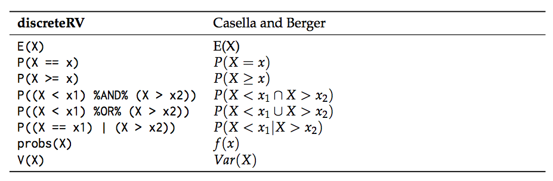
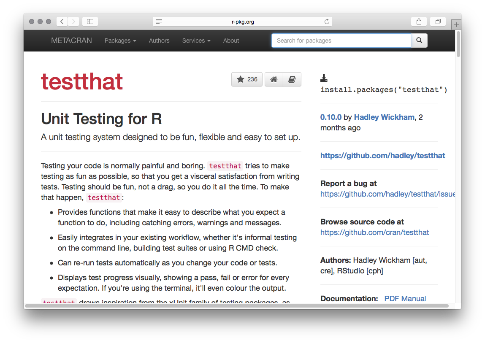
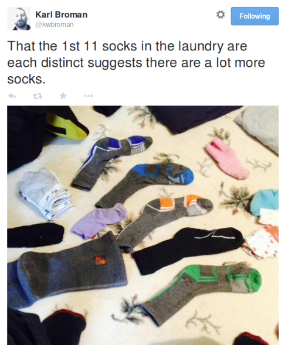
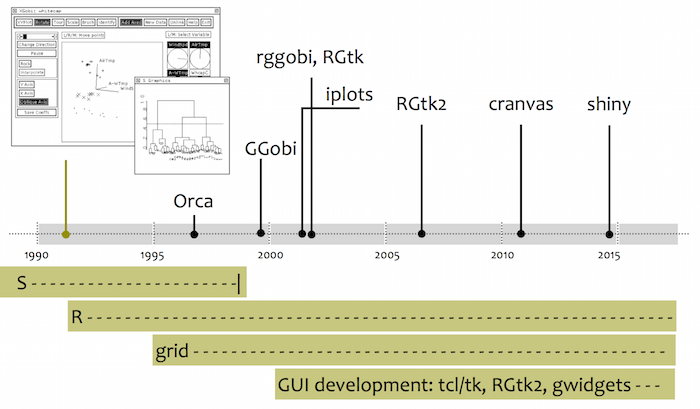

##

<big>useR! 2015 highlights</big>  
David L Miller & Rob Schick  
CREEMcrackers<small> 
CREEM, University of St Andrews 
31 July 2015</small>
 
 
 
 
 

#

General thoughts

# useR! 2015 in general

  * Still a weird (in a good way) conference
  * Huge range of talks
  * Standard of talks much higher than in previous years
  * [Complete list of talks, some with slides online](http://user2015.math.aau.dk/oral_sessions)

#

Talks I attended

# `archivist`: Tools for Storing, Restoring and Searching for R Objects

  * Przemysław Biecek, University of Warsaw
  * During analysis we create "artifacts" -- subsets, aggregations, plots, models $\Rightarrow$ `git`
  * `archivist` stores the artifacts and *relations between* them (if you use pipes `%a%`)
  * tags are generated from `ggplot2` plots from labels, can be added for others
  * [pbiecek.github.io/archivist/](http://pbiecek.github.io/archivist/)

# Manipulation of Discrete Random Variables in R with `discreteRV`

  * Eric Hare, Iowa State University
  * Bridge the gap between maths and R
  * [Paper](http://journal.r-project.org/archive/2015-1/hare-buja-hofmann.pdf)

# The METACRAN experiment

  * Gabor Csardi, Harvard
  * Make things easier to find on CRAN
  * Between github and CRAN, everything you need in one place
  * [r-pkg.org](http://www.r-pkg.org)

# Classroom experiments

  * James Curran, University of Auckland ([slides](http://user2015.math.aau.dk/presentations/22.pdf))
  * How to teach "modern" intro to stats?
  * Data collection? (But not time consuming/prone to failure?)
  * R benchmarks as non-messy experiment

# Tiny Data, Approximate Bayesian Computation and the Socks of Karl Broman

  * Rasmus Bååth, Lund University ([slides](http://user2015.math.aau.dk/presentations/33.pdf)) ([15 min talk](http://www.sumsar.net/blog/2015/07/tiny-data-and-the-socks-of-karl-broman-the-movie/)) ([blog](http://www.sumsar.net/blog/2014/10/tiny-data-and-the-socks-of-karl-broman/))
  * Excellent explanation of ABC (data+generative model+prior+criteria)

#

The talk I wish I'd attended

# Plotting data as music videos in R

  * Thomas Levine ([slides/explanation](https://thomaslevine.com/!/user-2015/))
  * We use scatterplots a lot
  * What about using music or kebabs?

#

Other stuff

# Other stuff

  * [rOpenSci](https://ropensci.org/)
    * Access to a **lot** of data (NOAA, eBird, BISON, etc)
    * Access to journals/data repositories (PLOS, figshare, ORCID, etc)
    * Bindings to `git`, databases, [lots more](https://ropensci.org/packages/)
  * `leaflet` -- interactive maps ([site](https://rstudio.github.io/leaflet/))
    - Not 100% sure how useful they are in an ecological setting (yet)
  * Groundswell towards: `RCpp`, `dplyr`, `shiny`, `magrittr`

#

Other highlights

# {.cover}

# {.cover}

# {.cover}

Thanks!

# {.cover}

# Talks I (Rob) attended

  * Reproducibility
  * Visualisation (who would have guessed?)

#

Reproducibility

# Package Cohorts

  * 4 Pillars of Data Analysis: data, code, statistical methods, software used
  * Software used: _Including Specific Versions_
  * Versioned Package Cohort
  * Two approaches: 

# Simple Reproducibility with `checkpoint` package

  * David Smith, Microsoft (nee Revolutions)
  * Uses `MRAN`: Microsoft R Archive Network
  * Easy, if heavy handed, way to create unique snapshots of current R environments and packages
  * `library(checkpoint)`
  * `checkpoint(‘2015-01-28’)` # only use package versions that existed at that date
  * `checkpoint(‘2015-01-28’, R.version = ‘3.1.1')` # forces it to be the same R engine
  * [slides/explanation](http://www.slideshare.net/RevolutionAnalytics/checkpoint-user-2015)

# Switching R Environments with `switchr`

  * Gabriel Becker and Michael Lawrence (R Core Member), GenenTech
  * Developed to allow multiple distributed collaborators (~100) within Genentech to share R-based work
  * `switchr` provides a framework for creating, populating, managing, and switching between multiple package libraries from within an R session
  * `switchTo()`
  * `switchBack()`
  * [Vignette](https://cran.r-project.org/web/packages/switchr/vignettes/switchrvign.pdf)
  * [slides](http://user2015.math.aau.dk/presentations/97.pdf)

#

Data Management

# `readr`: Getting your data into R 

  * Hadley Wickham, RStudio
  * `readr` makes it easy to read many types of tabular data and do it more quickly (~10x speedup)
  * Better on factors; better on guessing variable types with 100-line scan
  * Delimited files with `read_delim()`, `read_csv()`, `read_tsv()`, and `read_csv2()`
  * Fixed width files with `read_fwf()`, and `read_table()`
  * Web log files with `read_log()`
  * `install.packages("readr")`
  * Outputs a `dplyr` class
  * [Vignette](http://blog.rstudio.org/2015/04/09/readr-0-1-0/)  
  
# Testing with `testwhat` package

  * Filip Schouwenaars, Datacamp
  * Built on `testthat`
  * Provide informative messages upon error
  * Relevant for CREEM: Allows for Submission Correctness Tests
  * `test_error()`, `test_function()`
  * [Documentation on writing SCTs](https://teach.datacamp.com/sct-design)
  

  
# `assertr`: Failing fast and early: assertive/defensive programming for R data analysis pipelines 

  * Tony Fischetti, College Factual
  * Analysis errors are often errors in data, but can be impossible to detect _easily_
  * Provide info about how you expect the data to look
  * Deviations from these assumptions can be caught quickly
  * `mpg <- c(12.3, 45.2, 30.7, 23); mpg[2] <- - 1 * mpg[2]; mean(mpg)`
  * [Vignette](https://github.com/tonyfischetti/assertr/blob/master/vignettes/assertr.Rmd)
  * This led to an awkward moment...
  
# `ensurer` package already exists on CRAN 

  * Stephan Bache, Danske Commodities A/S
  * R does not provide any mechanism for type-safety and since it is not a compiled language, the risk of having unexpected results is there at runtime
  * [Vignette](https://github.com/smbache/ensurer/blob/master/vignettes/ensurer.Rmd)
  
  
# A proposal for distributed data-structures in R 

  * Indrajit Roy and Michael Lawrence, HP Labs and GenenTech
  * To scale computation, have to distribute data across multiple machines
  * Unified API for distributed computing. The API supports three shapes of data --- lists, arrays and data frames
  * [Blog Post](http://blog.revolutionanalytics.com/2015/02/the-hp-workshop-on-distributed-computing-in-r.html)
  
# Do Not Repeat Yourself Workflow

  * Pre-conference workshop from Peter Baker, University of Queensland
  * Scenarios
    * I have a very simple question that will only take 5 minutes. I won't need to see you again·
    * We have several data points that need deleting. Can you rerun the analysis, and insert the new tables and plot into our report by 4pm today?
    * The journal got back to us: Can you rerun the analysis to take account critisicms of our method? Its not the project we did last year but the one from 2009?
  * Focus on make, git, markdown
  * Keep directories same project to project
  * [package](https://github.com/petebaker/dryworkflow): sets up a git repo, and a standardised structure
  * [slides](https://petesstatsandr.wordpress.com/r-course-material/)

#

Visualisation
  

# Di Cook Plenary

  * Supervised two R-core members (Wickham & Lawrence)
  * Haven't progressed much in 20 years (XLispStat)
  * Tour of Tcl/Tk based interactive graphics
    * `Xwidgets`
    * `cranvas` [videos](https://vimeo.com/chxy/videos)
    * `RGtk`
    * `rggobi`
 
 
 
 
 
 
 
 
 
 
 

<!--  

-->
  
# Di Cook Plenary - New Developments

  * ggvis
  * animint
  * gridSVG - from Paul Murrell (more later)
  * plotly
  * rbokeh
  * loon (more later)
  * shiny - but interaction isn't there yet (though see this [example](https://gallery.shinyapps.io/095-plot-interaction-advanced/))

# Di Cook Plenary - Challenges to Young Developers

  * Interaction on the plot (not there yet)
  * diff types of brushes - e.g. don’t just pick up one point, but also 5 nearest neighbours 
  * linking by a key variable 
  * Program linking and brushing systems
  * strong connection with model fitting (modellers need us)
  * portability, easy install, web compatible
  * large data
  * incorporate inference (generate lots of plots and cycle between them)
  * conceptual framework
  *
  * [slides](http://user2015.math.aau.dk/presentations/invited_di_cook.pdf)  

# Nice maps for print using the `tmap` package 

  * Martijn Tennekes, Statistics Netherlands
  * Very nice lightweight way to make thematic maps, e.g. choropleth maps
  * Based on grammar of graphics
  * [vignette](http://cran.r-project.org/web/packages/tmap/vignettes/tmap-nutshell.html)
  * [Axis Maps Guide to Thematic Cartography](http://axismaps.github.io/thematic-cartography/)
  
  

  
  
# d3 and R shiny - making your graphs come to life

  * Monika Huhn, Astra Zeneca
  * Data not easily and directly accessible for medical experts
  * Use what is good about these three components
    * R - data manipulation
    * Shiny - web framework with reactive elements
    * [d3](http://d3js.org/) - beautiful graphics with animated transitions (key for researchers to trace path of a disease)
  
# shiny and htmlWidgets
  
  * Joe Cheng, RStudio
  * path from an R data frame to browser rendered java script is hard; htmlwidgets makes this easier
  * htmlwidgets vs shiny: they are not mutually exclusive. shiny is about tying together a constellation of things together - including html widgets.
    * [htmlwidgets](http://www.htmlwidgets.org/) - interactivity in the small; data are in the browser
    * shiny - interactivity in the large; need an R engine
  * [slides](https://github.com/jcheng5/user2015)
    
# Interactive Graphics with ggplot2 and gridSVG

  * Michael Sachs, National Cancer Institute
  * Problem was interactive ROC curves in medicine
  * Use R to make svgs with `grid.svg()` package (Murrell)
  * Use svg modification power of d3 to provide interactivity
  * [Example 1](http://sachsmc.github.io/UseR2015-Talk/#12)
  * [Example 2](http://sachsmc.github.io/UseR2015-Talk/#14)
  * [slides](http://sachsmc.github.io/UseR2015-Talk/#1)
  
  
# gridGraphics & gridSVG

  * Paul Murrell, University of Auckland
  * Pre-conference workshop on grid graphics
  * High-level plots (`ggplot2`, `lattice`); low-level edits (`grid`)
  * [slides & code](https://www.stat.auckland.ac.nz/~paul/useR2015-grid/)
  * Conference talk on `gridSVG` package ([R Journal Article](http://journal.r-project.org/archive/2014-1/murrell-potter.pdf))
  * [slides](https://www.stat.auckland.ac.nz/~paul/Talks/useR2015/gridgraphics.html)
  
# Where Does `grid` sit?

# `gridGraphics` links base and `grid`

  
# loon: Tcl/Tk based interactive visualisation toolkit in R
  
  * [Adrian Waddell](http://adrian.waddell.ch/), University of Waterloo
  * Developed [navgraph](http://www.navgraph.com/)
  * [Sign up to be a beta tester](http://navgraph.com/loon/)
  * [Example linked windows](http://adrian.waddell.ch/talks/Loon_useR_2015/assets/player/KeynoteDHTMLPlayer.html#34)
  * [slides](http://adrian.waddell.ch/talks/Loon_useR_2015/assets/player/KeynoteDHTMLPlayer.html#0)
  

# Teaching statistics with R: shiny

  * Gail Potter, Department of Statistics, California Polytechnic State University
  * shiny based project to help teach undergraduates statistics
  * [shiny apps here](http://www.statistics.calpoly.edu/shiny)

# Teaching statistics with R: course management with github

  * Colin Rundell, POP at Duke, ISDS
  * Talk went through how they teach course to Intro Stats students
  * I especially liked the use of Github as a course management system
    * pulls at the homework deadline
    * can distribute files with push
    * Accountability - everyone pushing commits, so he can see which student pushing all the code. He can intervene and hold individuals accountable
  * [Recent Blog Post on Jenny Bryan](http://blog.revolutionanalytics.com/2015/06/get-your-r-education-going-with-github.html)
  * [slides](https://github.com/rundel/Presentations/blob/master/UseR2015/user2015.pdf)
  
# {.cover}

